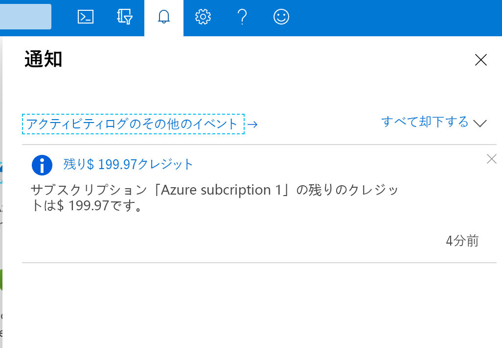

# ミニラボ: Azure portal を使用する

Azure portal では、さまざまな機能やサービスを使用できます。その中でも特に人気の機能をご紹介します。まず、上部のメニュー バーのアイコンのいずれかにマウス ポインターを数秒間ホバーします。それぞれのヒントのラベルがポップアップ表示されます。このラベルは、メニュー アイテムの名前です。これらのアイコンは後で使用します。

## すべてのサービス

1. Azure アカウントを使用して [Azure portal](https://portal.azure.com) にサインインします。

1. Azure portal 左上の 「**ポータルのメニューを表示**」 を選択します。

     

1. 「**すべてのサービス**」 を選択します。Azure では多数のサービスが提供されているため、リストを見るには数分程度かかります。

1. 「**すべて検索**」 ボックスでサービスを検索できます。

1. 「**仮想マシン**」 を選択します。表示されない場合は、検索ボックスを使用します。 「**仮想マシン**」 ウィンドウが表示されます。まだ仮想マシンを作成していないので、結果は表示されません。

1. 「**+ 追加**」 を選択します。 「**仮想マシンの作成**」 ウィンドウが表示されます。

1. 右上隅にある 「**X**」 を選択して 「**仮想マシンの作成**」 ウィンドウを閉じます。

1. 右上隅にある 「**X**」 を選択して 「**仮想マシン**」 ウィンドウを閉じます。

1. ホーム ページに戻る場合は、左上の 「**Microsoft Azure**」 を選択します。

## Azure Cloud Shell

Azure Cloud Shell を使用すると、Azure サブスクリプションに対するコマンドをコマンド ライン インターフェイス (CLI) から実行できます。ツール バーのアイコンを選択するとアクセスできます。https://shell.azure.com にアクセスすると、ポータルとは独立したブラウザーで Cloud Shell を起動することもできます。

Azure Cloud Shell はサンドボックス環境で使用できますが、サンドボックス バージョンのシェルは機能制限があります。Azure Cloud Shell のすべての機能を使用するには、独自の Azure サブスクリプションを使用します。

シェルを起動すると、ようこそウィンドウが表示されます。ユーザーの好みに応じて **Bash** 環境と **PowerShell** 環境のいずれかを選択できます。シェルは、シェルの左側にある言語ドロップダウンからいつでも変更することもできます。

最後に、作成した環境にはさまざまな管理ツールやプログラミング ツールが含まれています。

- Azure コマンドライン ツール (Azure CLI、AzCopy など)

- .NET コア、Python、および Java を含む言語/フレームワーク

- Docker、Kubernetes などのコンテナー管理のサポート

- vim、emacs、code、nano などのコード エディター

- ビルド ツール (make、maven、npm など)

- sqlcmd などのデータベース クエリ ツール

## ディレクトリとサブスクリプション

1. 「**Directory + Subscription (ブックとフィルター)**」 アイコンを選択し、 「**Directory + Subscription**」 ウィンドウを表示します。

  ここでは、複数のサブスクリプションやディレクトリを切り替えることができます。Microsoft Learn サンドボックス ディレクトリの Concierge サブスクリプションにアクセスしていることを確認します。同じメール アドレスに他の Azure ディレクトリが関連付けられている場合は、それらのサブスクリプションも同様に利用できます。

  ディレクトリとサブスクリプションの詳細については、リンク先の情報も参照してください。

2. 右上隅にある 「**X**」 を選択して 「**Directory + Subscription**」 ウィンドウを閉じます。

## 通知ウィンドウ

1. アイコン バーのメニュー バーで 「**通知**」 (ベル) アイコンを選択します。このウィンドウには、保留中の通知が表示されます。

    

1. 通知が表示されている場合は、いずれかの通知の上にマウスをホバーします。通知を無視する場合は 「**X**」 をクリックします。

1. 「**すべて無視**」 を選択します。通知が表示されなくなります。

1. 右上隅にある 「**X**」 を選択して 「**通知**」 ウィンドウを閉じます。

## 設定

1. 「**設定 (歯車)**」 アイコンを選択して 「**ポータルの設定**」 ウィンドウを開きます。既定で 「**全般**」 設定が表示されます。

1. ドロップダウンから 「**非アクティブな場合はサインアウト**」 設定を選択し、 「**1 時間後**」 を選択します。

1. 「**テーマの選択**」 で、色が違うテーマを選択するとポータルの UI が変わることを確認します。お好きな設定を選択してください。

1. 「**ハイ コントラストのテーマ**」 で、3 種類のオプションを試してみてください。

1. 「**ポップアップ通知を有効にする**」 を選択します。このオプションをオンにすると、通知は「トースト」スタイルの通知としてポップアップ表示されます。通知 (ベル) アイコンも引き続き表示されます。

1. 設定で 「**言語/国または地域**」 タブを選択します。 「**言語**」、 「**Español**」 の順に選択して、 「**適用**」 ボタンを選択します。 「**このページを翻訳する**」 ダイアログ ボックスが表示されたら、このボックスを閉じます。これでポータル全体がスペイン語になりました。

1. 英語に戻すには、 上部のメニュー バーで 「**設定 (歯車)**」 アイコンを選択し、 「**Idioma y región**」 という設定に切り替えます。 「**Idioma**」、 「**英語**」 の順に選択します。 「**Aplicar**」 ボタンをクリックします。ポータルが英語に戻ります。

## ヘルプ ウィンドウ

1. 「**ヘルプ (?)**」 アイコンを選択して 「**ヘルプ**」 ウィンドウを表示します。

1. 「**ヘルプとサポート**」 ボタンを選択します。

1. 「**ヘルプとサポート**」 ウィンドウで 「**サポート**」、 「**新しいサポート リクエスト**」 の順に選択します。新しいサポート リクエストを作成するには、次の各セクションの情報を入力してから 「**作成**」 を選択して、問題を解決します。

    - **基本**: 問題の種類

    - **問題**: 問題の重大度、概要と説明、詳細情報

    - **連絡先情報**: ご希望の連絡方法とこの連絡方法に関連する情報

1. 「**すべてのサポート リクエスト**」 を選択すると、サポート リクエストの状態を表示できます。

>:heavy_check_mark: **注記:** サポート リクエストは、アクティブな有料サブスクリプションでのみ作成できます。

### 最新情報やその他の情報

1. 「**ヘルプ**」 アイコンを選択してから 「**最新情報**」 を選択します。

1. 最近リリースされた機能が表示されます。また、次のような 「**ヘルプ**」 メニュー オプションも表示されます。

    - Azure ロードマップ

    - ガイド ツアーを開始する

    - キーボード ショートカット

    - 診断を表示する

    - プライバシーに関する声明

1. 右上隅にある 「**X**」 を選択して 「**ヘルプ**」 ウィンドウを閉じます。

1. 「**最新情報**」 ウィンドウを閉じます。ダッシュボードに戻ります。

## 「フィードバック」 ウィンドウ

1. 「**フィードバック (スマイル)**」 アイコンを選択して 「**フィードバックを送信**」 ウィンドウを開きます。

1. 「**フィードバックをお寄せください**」 ボックスに Azure の印象を入力し、 「**Microsoft からメールでご連絡させていただきます**」 というボックスを選択し、 「**フィードバックを送信**」 を選択します

1. **フィードバック送信**メッセージが表示され、終了します。ダッシュボードに戻ります。

## プロファイルの設定

1. ポータルの右上隅にある自分の名前を選択します。次のオプションがあります。

    - 別のアカウントでサインインするか、完全にサインアウトします

    - パスワードを変更できるアカウント プロファイルを表示する

    - アイデアを送信する

    - アクセス許可を確認する

    - 請求書を表示する

    - 連絡先情報を更新する

    これらの項目の一部は、 「...」 アイコンを選択しないと表示されません。

1. 「...」、 「**請求書を表示**」 の順に選択して 「**コスト管理と請求 - 請求書**」 ページに移動すると、Azure 料金の内訳を確認できます。

1. ドロップダウン リストからサブスクリプションを選択します。

1. 請求期間を選択します。

1. サービスの料金をメモし、現在のサブスクリプションの予算と比較します。

1. 右上の 「**X**」 を選択して 「**サービスごとのコスト**」 ウィンドウを閉じます。

1. 右上の 「**X**」 を選択して 「**コスト管理と請求 - 請求書**」 ページを閉じ、ホーム ページに戻ります。
