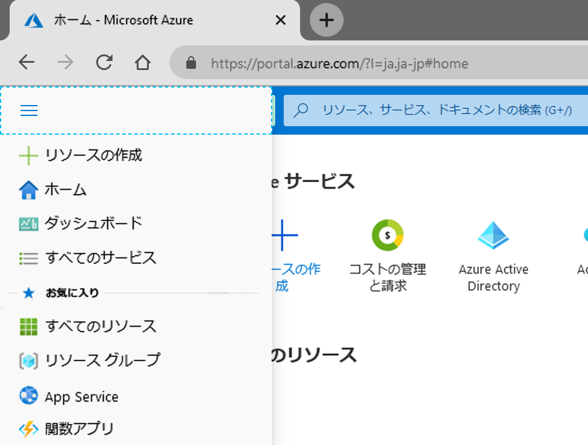

# ミニラボ: Azure portal を使用する

Azure portal では、さまざまな機能やサービスを使用できます。その中でも特に人気の機能をご紹介します。まず、上部のメニュー バーのアイコンのいずれかにマウス ポインターを数秒間ホバーします。ヒント ラベル ポップアップは、各アイコンに対して使用できるはずです。このラベルは、メニュー アイテムの名前です。これらのアイコンは後で使用します。

狭い画面では、メニューが表示されない場合があります、省略記号 (..) ボタンを選択します。

![[省略] ボタン アイコン](../../Linked_Image_Files/three-points.png)

## すべてのサービス
Azure portal には、いくつかのサービスがあります。

1. Azure アカウントを使用して [Azure portal](https://portal.azure.com) にサインインします。

1. Azure portal 左上の 「**ポータルのメニューを表示**」 を選択します。

     

1. 「**すべてのサービス**」 を選択します。 
    * Azure が提供する多数のサービスのリストを確認するには数分程度かかります。

1. 「**仮想マシン**」 を選択します。(または、ビューの左上隅にある検索ボックスを使用します)。

1. 「**仮想マシン**」 ウィンドウが表示されます。以前に仮想マシンを作成していない限り、結果はありません。

1. 「**+ 追加**」 を選択します。「**仮想マシンの作成**」 ウィンドウが表示されます。

1. 右上隅にある 「**X**」 を選択して 「**仮想マシンの作成**」 ウィンドウを閉じます。

1. 右上隅にある 「**X**」 を選択して 「**仮想マシン**」 ウィンドウを閉じます。

1. ホーム ページに戻る場合は、左上の 「**Microsoft Azure**」 を選択します。

## Azure Cloud Shell

Azure Cloud Shell を使用すると、Azure サブスクリプションに対するコマンドをコマンド ライン インターフェイス (CLI) から実行できます。ツール バーのアイコンを選択するとアクセスできます。https://shell.azure.com にアクセスすると、ポータルとは独立したブラウザーで Cloud Shell を起動することもできます。

作成した環境にはさまざまな管理ツールやプログラミング ツールが含まれています。

- Azure コマンドライン ツール (Azure CLI、AzCopy など)
- .NET コア、Python、および Java を含む言語/フレームワーク
- Docker、Kubernetes などのコンテナー管理のサポート
- vim、emacs、code、nano などのコード エディター
- ビルド ツール (make、maven、npm など)
- sqlcmd などのデータベース クエリ ツール

CLI の操作:

1. Azure Cloud Shell アイコンをクリックする

1. ユーザーの好みに応じて **Bash** 環境と **PowerShell** 環境のいずれかを選択できます。任意の選択 
    * シェルは、シェルの左側にある言語ドロップダウンからいつでも変更することもできます。
1. これで、Azure CLI にアクセスできました
1. 書き込み
    > az version
1. CLI は、Cloud Shell CLI バージョンに関する基本情報を JSON 形式で返します
1. 右上の 「**X**」 をクリックすると、閉じることもできます。 

## ディレクトリとサブスクリプション

1. 「**Directory + Subscription (ブックとフィルター)**」 アイコンを選択し、「**Directory + Subscription**」 ウィンドウを表示します。

  ここでは、複数のサブスクリプションやディレクトリを切り替えることができます。同じメール アドレスに他の Azure ディレクトリが関連付けられている場合は、それらのサブスクリプションも同様に利用できます。

  ディレクトリとサブスクリプションの詳細については、リンク先の情報も参照してください。

2. 右上隅にある 「**X**」 を選択して 「**Directory + Subscription**」 ウィンドウを閉じます。

## 通知ウィンドウ

1. アイコン バーのメニュー バーで 「**通知**」 (ベル) アイコンを選択します。このウィンドウには、保留中の通知が表示されます。

    

1. 通知が表示されている場合は、いずれかの通知の上にマウスをホバーします。通知を無視する場合は 「**X**」 をクリックします。

1. 「**すべて無視**」 を選択します。通知が表示されなくなります。

1. 右上隅にある 「**X**」 を選択して 「**通知**」 ウィンドウを閉じます。

## 設定

1. 「**設定 (歯車)**」 アイコンを選択して 「**ポータルの設定**」 ウィンドウを開きます。既定で 「**全般**」 設定が表示されます。

1. 「**非アクティブ時にサインアウトする**」 設定をドロップ ダウンします。  そこで、たとえば、 自動サインアウトの場合は非アクティブの **1 時間後**を選択するなど、便利なオプションを選択できます。 

1. 「**テーマの選択**」 で、色が違うテーマを選択するとポータルの UI が変わることを確認します。お好きな設定を選択してください。

1. 「**ハイ コントラストのテーマ**」 で、3 種類のオプションを試してみてください。

1. 「**ポップアップ通知を有効にする**」 を選択します。このオプションをオンにすると、通知は「トースト」スタイルの通知としてポップアップ表示されます。通知 (ベル) アイコンも引き続き表示されます。

1. 設定で 「**言語/国または地域**」 タブを選択します。「**言語**」、「**Español**」 の順に選択して、「**適用**」 ボタンを選択します。「**このページを翻訳する**」 ダイアログ ボックスが表示されたら、このボックスを閉じます。これでポータル全体がスペイン語になりました。

1. 英語に戻すには、 上部のメニュー バーで 「**設定 (歯車)**」 アイコンを選択し、「**Idioma y región**」 という設定に切り替えます。「**Idioma**」、「**英語**」 の順に選択します。「**Aplicar**」 ボタンをクリックします。ポータルが英語に戻ります。

## ヘルプ ウィンドウ

1. 「**ヘルプ (?)**」 アイコンを選択して 「**ヘルプ**」 ウィンドウを表示します。

1. 「**ヘルプとサポート**」 ボタンを選択します。

>:heavy_check_mark: **注:** サポート リクエストは、アクティブな有料サブスクリプションを使用してのみ作成できるため、これらの手順の一部は現在の UI とは異なる場合があります。

1. 「**ヘルプとサポート**」 ウィンドウで 「**サポート**」、「**新しいサポート リクエスト**」 の順に選択します。新しいサポート リクエストを作成するには、次の各セクションの情報を入力します。

    - **基本**: 問題の種類

    - **問題**: 問題の重大度、概要と説明、詳細情報

    - **連絡先情報**: ご希望の連絡方法とこの連絡方法に関連する情報

1. 「**作成**」 を選択して問題を提出します。

1. 「**すべてのサポート リクエスト**」 を選択すると、サポート リクエストの状態を表示できます。

### 最新情報やその他の情報

1. 右上の 「**ヘルプ**」 アイコンを再度選択し、「**最新情報**」 を選択します。

1. 最近リリースされた機能が表示されます。また、次のような 「**ヘルプ**」 メニュー オプションも表示されます。
    - Azure ロードマップ
    - ガイド ツアーを開始する
    - キーボード ショートカット
    - 診断を表示する
    - プライバシーに関する声明

1. 右上隅にある 「**X**」 を選択して 「**最新情報**」 ウィンドウを閉じます。ダッシュボードに戻ります。

## フィードバック ウィンドウ

Azure の体験の任意の時点で、フィードバックがある場合、または提案を行う場合は、次の操作を行うことができます。

1. 「**フィードバック (スマイル)**」 アイコンを選択して 「**フィードバックを送信**」 ウィンドウを開きます。

1. 「**お客様のエクスペリエンスについて教えてください**」 で、Azure の印象を入力してください 

1. 「**Microsoft からフィードバックについてメールをお送りする場合があります**」 というボックスを選択してください

1. 「**フィードバックの送信**」 を選択します。

1. **フィードバック送信**メッセージが表示され、終了します。ダッシュボードに戻ります。

## プロファイルの設定

1. ポータルの右上隅にある自分の名前を選択して、プロファイル情報を表示します。
    - お名前
    - メール
    - 「マイ Microsoft アカウント」リンク
    - 「ディレクトリの切り替え」リンク
    - 別のアカウントでサインインするか、完全にサインアウトします
    - 「楕円」 ボタン。クリックすると、その他のオプションが表示されます
    
        

1. 「...」、「**請求書を表示**」 の順に選択して 「**コスト管理と請求 - 請求書**」 ページに移動すると、Azure 料金の内訳を確認できます。

1. 左のメニューで、「**コスト管理**」 に移動します

1. 同じ左側のメニューで、コスト管理の下の 「**コスト分析**」 を選択します

1. 表示されたグラフの右上にある 「**ビュー**」 でクリックします 

    

1. ドロップダウン メニューから 「**サービス別のコスト**」 を選択します

>:heavy_check_mark: **注:** 各サービスのコストの詳細を提供します。アカウントが新規の場合、または無料サービスのみを使用している場合。このページは空の場合があります

1. 右上の 「**X**」 を選択して 「**サービス別のコスト**」 ウィンドウを閉じます。

1. 右上隅の 「**X**」 を選択して 「**コスト管理と請求 - 請求書**」 ページを閉じ、ホーム ページに戻ります。
