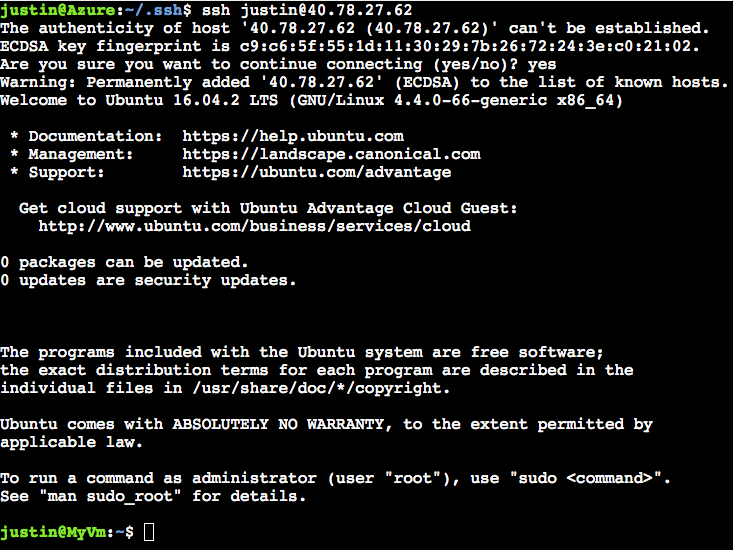

# ミニラボ: Azure Cloud Shell で Bash のクイックスタート

このドキュメントでは、Azure ポータルで Azure Cloud Shell で Bash を使用する方法について説明します。

## Cloud Shell を起動する

1. Azure アカウントを使用して [Azure portal](https://portal.azure.com) にサインインします。

1. Azure portal のナビゲーション上部から **Cloud Shell** を起動します。


1. ストレージ アカウントと Microsoft Azure ファイル共有を作成するサブスクリプションを選択します。

1. 「**ストレージを作成する**」 を選択します。

>:pencil: **ヒント:** すべてのセッションで Azure CLI に対して自動的に認証されます。

## Bash 環境を選択する

シェルウィンドウの左側の環境ドロップダウンに **Bash** と表示されていることを確認します。


## サブスクリプションを設定する

1. Azure CLI にアクセスできるサブスクリプションを一覧表示する

    ```
    az account list
    ```

1. 目的に合うサブスクリプションを設定する:

    ```
    az account set --subscription 'my-subscription-name'
    ```
>:pencil: **ヒント:** `/home/<user>/.azure/azureProfile.json` を使用する次回のセッションのため、システムはサブスクリプションを記憶します。

## リソース グループを作成する

WestUS で "MyRG" という名前の新しいリソース グループを作成します。

```
az group create --location westus --name MyRG
```

## Linux VM を作成する

新しいリソース グループに Ubuntu VM を作成します。Azure CLI は SSH キーを作成し、そのキーで VM を設定します。

```
az vm create -n myVM -g MyRG --image UbuntuLTS --generate-ssh-keys
```

>:heavy_check_mark: **注記:** `--generate-ssh-keys` を使用すると、Azure CLI に VM と `$Home` ディレクトリに公開キーと秘密キーを作成して設定するように指示します。規定値では、キーは Cloud Shell の `/home/<user>/.ssh/id_rsa` および `/home/<user>/.ssh/id_rsa.pub` に配置されます。 `.ssh` フォルダーは、 `$Home` の永続化に使用される添付ファイル共有の 5 GBイメージに永続化されます。

この VM のユーザー名は、Cloud Shell ($User@Azure:) で使用されるユーザー名になります。

## Linux VM に SSH を入れる

1. Azure ポータルの検索バーで VM 名を検索します。

1. 「**接続**」 をクリックして、VM名とパブリック IP アドレスを取得します。

    

1. ssh コマンドを使用して VM に SSH を追加します。

    ```
    ssh username@ipaddress
    ```

SSH 接続を確立すると、Ubuntu の Welcome ダイアログが表示されます。



## クリーンアップ

1. SSH セッションを終了します。

    ```
    exit
    ```

1. リソース グループとその中のすべてのリソースを削除することです。

    ```
    az group delete -n MyRG
    ```
