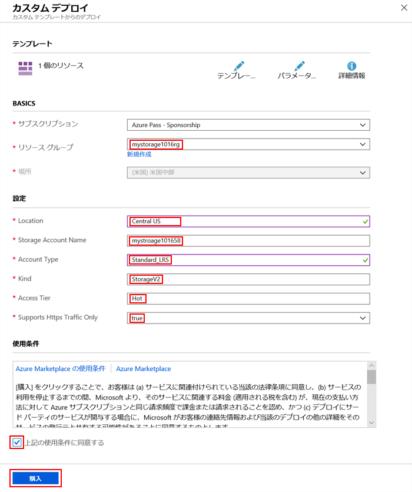

# ミニラボ: Azure potal を使用したARM テンプレートの作成

このミニラボでは、Azure portal を使用して Azure Resource Manager テンプレートを作成、編集、およびデプロイする方法について学習します。このミニラボでは、Azure Storage アカウントを作成する方法を示しますが、同じプロセスを使用して他の Azure リソースを作成できます。

## ポータルを使用してテンプレートを生成する

Azure portal を使用して、Azure ストレージ アカウントなどのリソースを構成できます。リソースをデプロイする前に、構成を Resource Manager テンプレートにエクスポートできます。テンプレートを保存して、後で再利用できます。

1. Azure potal: https://portal.azure.com/ にサインインします。

2. **「リソースの作成」 > 「ストレージ」 > 「ストレージ アカウント**」 を選択します。

 3. 次の情報を入力します。

    * **リソース グループ:** **新規作成**を選び、選択したリソース グループ名を指定します。 
    * **名前:** ストレージ アカウントに一意の名前を付けます。ストレージ アカウント名：uniqueName (すべての Azure で一意)「ストレージ アカウント名は既に使用されています」というエラー メッセージが表示された場合は、 **\<your name\>storage\<Today's date in MMDD\>** (例えば *mystorage1016*) を使用してみてください。
    
    * 残りのプロパティには既定値を使用できます。 **注:** エクスポートされたテンプレートの中には、デプロイする前にいくつかの編集が必要な場合があります。

4. 画面の下部にある 「**Review + create**」 を選択します。

    ❗️ **注：**  次のステップでは **作成** を選択し***ない***でください。

5. 画面の下部にある 「**自動化用のテンプレートをダウンロードする**」 を選択してください。ポータルには、生成されたテンプレートが表示されます。

    * メイン ペインにテンプレートが表示されます。これは、6 つの最上位要素を持つ JSON ファイルです。 `スキーマ`、 `contentVersion`、 `パラメータ`、 `変数`、 `リソース`、および `出力`。

    * 6 つのパラメータが定義されています。そのうちの 1つは **storageAccountName** と呼ばれています。次のセクションでは、テンプレートを編集して、ストレージ アカウントに生成された名前を使用します。

    * テンプレートでは、1 つの Azure リソースが定義されています。タイプは `Microsoft.Storage/storageAccounts` です。リソースの定義方法と定義構造に注意してください。
    
6. スクリーンの上部にある **「ダウンロード」** を選択します。ダウンロードした zip ファイルを開き、 **template.json** をコンピューターに保存します。次のセクションでは、Template Deployment ツールを使用してテンプレートを編集します。

7. **パラメーター** タブを選択して、パラメーターに指定した値を表示します。これらの値を書き留めます。テンプレートをデプロイするときに次のセクションで必要になります。

 
## テンプレートの編集と展開

Azure portal を使用すると、*テンプレートのデプロイ*と呼ばれるポータル ツールを使用して、基本的なテンプレート編集を実行できます。より複雑なテンプレートを編集するには、より豊富な編集機能を提供する Visual Studio Code の使用を検討してください。

Azure では、各 Azure サービスに一意の名前が必要です。既に存在するストレージ アカウント名を入力すると、展開は失敗します。この問題を回避するには、テンプレート関数 `uniquestring()` を使用して、一意のストレージ アカウント名を生成します。

1. Azure potal で、 **ストレージ アカウント** を選択します。

2. **マーケットプレースを検索 で** **Template Deployment** を入力し、 ** ENTER** キーを押 します。

3. 「 **テンプレートの展開 (カスタム テンプレートを使用した展開)」** を選択します。

4. 「**作成**」 を選択します。

5. エディタを開くために 「**独自のテンプレートを作成**」 を選択します。

6. **ファイルを読み込む** を選択し、手順に従って、最後のセクションでダウンロードした *template.json* を読み込みます。

7. テンプレートに次の 3 つの変更を加えます。

    * パラメーター要素から **storageAccountName** `パラメータ` を削除します。 
    * 以下の `「変数」` 要素に、 **storageAccountName**という名前の変数を 1 つ追加します。次の例では、一意のストレージ アカウント名が生成されます。
        ```JSON
        "storageAccountName": "[concat(uniqueString(subscription().subscriptionId), 'storage')]"
        ```
    * Update the name element of the **Microsoft.Storage/storageAccounts** resource to use the newly defined variable instead of the parameter:
       ```json
       "name": "[variables('storageAccountName')]",
       ```   

8. **「保存」** を選択します。

9. 表示されたフォームの 「**基本**」 セクションで、最後のセクションで作成したリソース グループを選択します。

10. フォームの 「**設定**」 セクションで、前のセクションの手順 8 で書き留めたパラメーターの値を入力します。これは、サンプル デプロイのスクリーンショットです。

    

10. 他の既定設定を受け入れて、 **作成** を選択します。

11. 画面上部からベル アイコン (通知) を選択し、デプロイ ステータスを表示します。展開が完了するまで待機します。

12. 通知ウィンドウから **リソース グループに移動** を選択します。デプロイ ステータスが正常に完了し、リソース グループにストレージ アカウントが 1 つしかないことがわかります。ストレージ アカウント名は、テンプレートによって生成される一意の文字列です。 

## リソースをクリーン アップする

Azure リソースが不要になったら、リソース グループを削除して、デプロイしたリソースをクリーン アップします。
