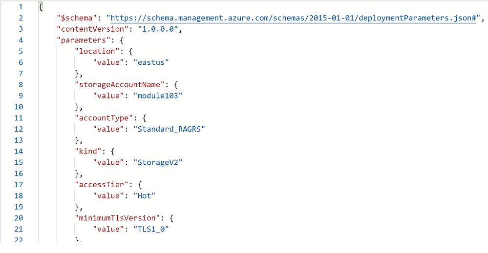
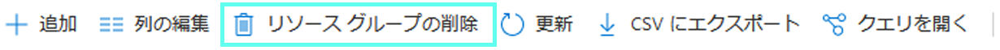
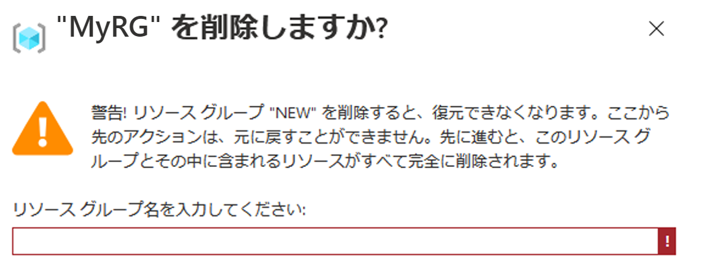

# ミニラボ: Azure potal を使用して ARM テンプレートを作成する

このミニラボでは、Azure portal を使用して Azure Resource Manager テンプレートを作成、編集、およびデプロイする方法について学習します。このミニラボでは、Azure Storage アカウントを作成する方法を示しますが、同じプロセスを使用して他の Azure リソースを作成できます。

## ポータルを使用してテンプレートを生成する

Azure portal を使用して、Azure ストレージ アカウントなどのリソースを構成できます。リソースをデプロイする前に、構成を Resource Manager テンプレートにエクスポートできます。テンプレートを保存して、後で再利用できます。

1. Azure potal: https://portal.azure.com/ にサインインします。

1. 「**リソースの作成**」 を選択します

1. 「**マーケットプレイスの検索**」 で、「ストレージ アカウント」と入力し、表示されるオプションを選択します

1. 「*ストレージ アカウント*」 が表示されたら、「**作成**」 をクリックします。

1. 次の情報を入力します。

    * **リソース グループ:** **新規作成**を選び、選択したリソース グループ名を指定します。 
    * **ストレージ アカウント名**ストレージ アカウントに一意の名前を付けます。ストレージ アカウント名：uniqueName (すべての Azure で一意)「ストレージ アカウント名は既に使用されています」というエラー メッセージが表示された場合は、**\<your name\>storage\<Today's date in MMDD\>** (例えば *jackstorage1016*) を使用してみてください。
    
    * 残りのプロパティには既定値を使用できます。
    > **注:** エクスポートされたテンプレートの中には、デプロイする前にいくつかの編集が必要な場合があります。

1. 画面の左下部にある 「**Review + create**」 をクリックします。

    ❗️ **N注：**  次のステップでは **作成** を選択しないでください。

1. 画面の右下部にある 「**自動化用のテンプレートをダウンロードする**」 を選択します。ポータルには、生成されたテンプレートが表示されます。

    * メイン ペインにテンプレートが表示されます。これは、6 つの最上位要素を持つ JSON ファイルです。`スキーマ`、 `contentVersion`、 `パラメータ`、 `変数`、 `リソース`、 および `出力`。

    * 6 つの**パラメータ**が定義されています。そのうちの 1つは **storageAccountName** と呼ばれています。 
        > 次のセクションでは、ストレージ アカウントに生成された名前を使用するためにテンプレートを編集します。

    * テンプレートでは、1 つの Azure **リソース**が定義されています。タイプは `Microsoft.Storage/storageAccounts` です。リソースの定義方法と定義構造に注意してください。
    
1. 画面の上部 (「テンプレート」の下) から 「**ダウンロード**」 を選択します。 

1. ダウンロードした zip ファイルを開くと、2 つのファイルがあります (**parameters.JSON** と  **template.JSON**)。両方のファイルをコンピューターに保存します。 
    > 次のセクションでは、Template Deployment ツールを使用してテンプレートを編集します。

1. **パラメータ** タブを選択して、パラメータに指定した値を取得します。これらの値を書き留めます。テンプレートをデプロイするときに次のセクションで必要になります。
    * 例:

        

1. ウィンドウの左上にある **Microsoft Azure** ラベルを押してホーム ビューに戻ります
 
## テンプレートを編集、デプロイする

Azure portal を使用すると、*テンプレートのデプロイ*と呼ばれるポータル ツールを使用して、基本的なテンプレート編集を実行できます。より複雑なテンプレートを編集するには、より豊富な編集機能を提供する Visual Studio Code の使用を検討してください。

> **ヒント:** Azure では、各 Azure サービスに一意の名前が必要です。既に存在するストレージ アカウント名を入力すると、展開は失敗します。この問題を回避するには、テンプレート関数 `uniquestring()` を使用して、一意のストレージ アカウント名を生成します。

1. Azure potal で、**ストレージ アカウント** を選択します。

1. **Search the Marketplace** で、**template deployment** を入力して、 表示されるオプションを選択します。
(**テンプレートのデプロイ (カスタム テンプレートを使用したデプロイ)**)。

1. 「**作成**」 を選択します。

1. エディタを開くために 「**エディターで独自のテンプレートをビルド**」 を選択します。

1. 「*テンプレートの編集*」 の下のメニューから 「**ロード ファイル**」 を選択し、前のセクションでダウンロードした *template.json* ファイルを選択します。

1. テンプレートに次の 3 つの変更を加えます:

    * パラメーター要素から **storageAccountName** `パラメータ` を削除します。 
    * 以下の `変数` 要素に、**storageAccountName**という名前の変数を 1 つ追加します。次の例では、一意のストレージ アカウント名が生成されます。
        ```JSON
        "storageAccountName": "[concat(uniqueString(subscription().subscriptionId), 'storage')]"
        ```
    * **Microsoft.Storage/storageAccount** が配置されている場所の `リソース` の name 要素を更新して、パラメーターの代わりに新しく定義された変数を使用します。
       ```json
       "name": "[variables('storageAccountName')]",
       ```   

1. 「**保存**」 を選択します。

1. フォームが表示されます

1. 表示されたフォームの 「**基本**」 セクションで、最後のセクションで作成したリソース グループを選択します。

1. フォームの 「**設定**」 セクションで、前のセクションの手順 8 で書き留めたパラメーターの値を入力します。デプロイ サンプルのスクリーンショットを次に示します:

    

1. 他の既定設定を受け入れて、**作成** を選択します。

1. デプロイ ステータスを表示するには、画面上部からベル アイコン (通知) を選択します。
    > デプロイが完了するまで待機します。

1. デプロイが完了したら、「通知」 ウィンドウから 「**リソース グループに Go**」 を選択します。この情報は、デプロイ ステータスが成功し、リソース グループにストレージ アカウントが 1 つしかないことを示します。ストレージ アカウント名は、テンプレートによって生成される一意の文字列です。 

## リソースをクリーン アップする

Azure リソースが不要になったら、リソース グループを削除して、デプロイしたリソースをクリーン アップします。

1. 上のオプションから、「**リソース グループを削除する**」 をクリックします。

    

1. アクションを確認するために、**TYPE THE RESOURCE GROUP NAME** を行うように求められます。

    

1. これで、ウィンドウの下部にある 「**削除する**」 ボタン をクリックできるようになります

1. リソースが削除されたことを示す通知ウィンドウを待ちます

1. 完了です!
