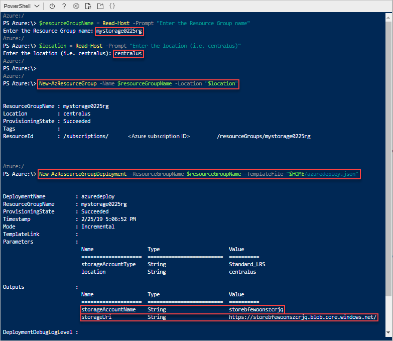

# ミニラボ: Visual Studio Code を使用して ARM テンプレートを作成する

このミニラボでは、Visual Studio Code と Azure Resource Manager ツール拡張機能を使用して Azure Resource Manager テンプレートを作成および編集する方法を学習します。拡張機能なしでも Visual Studio Code で Resource Manager テンプレートを作成できますが、拡張機能にはテンプレートの開発を簡略化するオートコンプリート オプションがあります。

多くの場合、[Azure クイック スタート テンプレート](https://azure.microsoft.com/resources/templates/)サイトで利用可能な既存のクイック スタート テンプレートをもとに ARM テンプレートの構築を開始する方が簡単で優れています。

このミニラボは、[Standard Storage アカウントの作成](https://azure.microsoft.com/resources/templates/101-storage-account-create/)テンプレートに基づいています。

## 前提条件

次のものが必要となります。

* Visual Studio Code。こちらからコピーをダウンロードできます。[https://code.visualstudio.com/](https://code.visualstudio.com/).
* Resource Manager ツール拡張機能。

次の手順に従って、リソース マネージャ ツール拡張機能をインストールします。

1. Visual Studio Code を起動します。
2. **Ctrl キーを押しながら SHIFT キーを押し Xキー** を押して、「拡張機能」 ウィンドウを開きます。
3. **Azure Resource Manager ツールを**検索 し、 **インストール** を選択します。
4. 拡張機能のインストールを完了するには、 **リロード** を選択します。

## クイックスタート テンプレートを開く

1. Visual Studio Code から、 **「ファイル」 > 「ファイルを開く」** を選択します。

2. **ファイル名** で、次の URL を貼り付けます。

    ```
    https://raw.githubusercontent.com/Azure/azure-quickstart-templates/master/101-storage-account-create/azuredeploy.json
    ```

3. **Open (開く)** を選択して、ファイルを開きます。

4. **「ファイル」 から 名前を付けて保存** を選択して、ファイルを *azuredeploy.json* としてローカル コンピュータに保存します。

## テンプレートを編集する

outputs セクションに要素をもう 1 つ追加して、ストレージ URI を表示します。

1. エクスポートしたテンプレートに出力をもう 1 つ追加します:

    ```json
    "storageUri": {
        "type": "string",
        "value": "[reference(variables('storageAccountName')).primaryEndpoints.blob]"
    },
    ```

    完了すると、出力セクションは次のようになります。

    ```json
    "outputs": {
        "storageAccountName": {
            "type": "string",
            "value": "[variables('storageAccountName')]"
        },
        "storageUri": {
            "type": "string",
            "value": "[reference(variables('storageAccountName')).primaryEndpoints.blob]"
        }
    }
    ```

    Visual Studio Code 内でコードをコピーして貼り付けたら、**value** 要素を再入力して、Resource Manager ツール拡張機能の IntelliSense 機能を体験してみます。

    

2. **「ファイル」 → 「保存」** を選択してファイルを保存します。


## テンプレートをデプロイする

テンプレートをデプロイするための多くの方法があり、Azure Cloud Shell を使用します。 

1. [Azure Cloud Shell](https://shell.azure.com/) にサインインします。

2. 左上の 「**PowerShell**」 環境を選択します。切り替え時にシェルを再起動する必要があります。 

3. 「ファイル**のアップロード/ダウンロード**」、 「**アップロード**」 の順に選択します。

    ![インターフェイスの [ファイルのアップロード] ボタンの場所を示す図](../../Linked_Image_Files/azure-portal-cloud-shell-upload-file-powershell.png)

    前のセクションで保存したファイルを選択します。既定の名前は **azuredeploy.json** です。テンプレート ファイルはシェルからアクセスできる必要があります。**ls** コマンドと **cat** コマンドを使用して、ファイルが正常にアップロードされたことを確認できます。
    
4. Cloud Shell から、次のコマンドを実行します。 

    ```powershell
    $resourceGroupName = Read-Host -Prompt "Enter the Resource Group name"
    $location = Read-Host -Prompt "Enter the location (i.e. centralus)"

    New-AzResourceGroup -Name $resourceGroupName -Location "$location"
    New-AzResourceGroupDeployment -ResourceGroupName $resourceGroupName -TemplateFile "$HOME/azuredeploy.json"
    ```

    ファイルを **azuredeploy.json** 以外の名前に保存する場合は、テンプレート ファイル名を更新します。

    次のスクリーン ショットは、展開例を示しています。

    

    outputs セクションにあるストレージ アカウント名とストレージ URL は、スクリーンショット上で強調されています。 

## リソースをクリーン アップします

Azure リソースが不要になったら、リソース グループを削除して、デプロイしたリソースをクリーン アップします。

