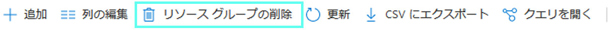
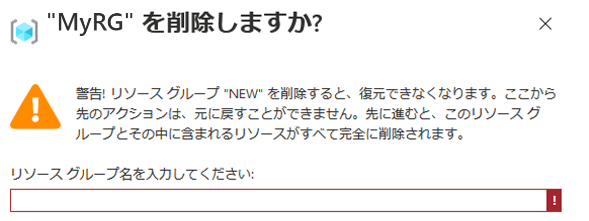

# ミニラボ: Visual Studio Code を使用して ARM テンプレートを作成する

**Azure Resource Manager (ARM)** は、Azure アカウントのリソースを作成、更新、および削除できる管理層を提供する Azure のサービスです。

このミニラボでは、Visual Studio Code と Azure Resource Manager (ARM) ツール拡張機能を使用して Azure Resource Manager テンプレートを作成および編集する方法を学習します。Visual Studio Code では、拡張機能を使わずに Resource Manager テンプレートを作成することもできますが、拡張機能を利用すれば、オートコンプリート オプションによってテンプレートの開発を簡素化することができます。

多くの場合、[Azure クイック スタート テンプレート](https://azure.microsoft.com/resources/templates/) のサイトで入手できる既存のクイック スタート テンプレートに基づいて ARM テンプレートの作成を開始する方が簡単で優れています。

このミニラボは、[Standard Storage アカウントの作成](https://azure.microsoft.com/resources/templates/101-storage-account-create/)テンプレートに基づいています。

## 前提条件

次のものが必要となります。

* Visual Studio Code。こちらからコピーをダウンロードできます。[https://code.visualstudio.com/](https://code.visualstudio.com/).
* Resource Manager ツール拡張機能。

次の手順に従って、リソース マネージャ ツール拡張機能をインストールします。

1. Visual Studio Code を起動します。
1. **Ctrl キーを押しながら SHIFT キーを押し Xキー** を押して、「拡張機能」 ウィンドウを開きます。
1. Azure Resource Manager ツールを**検索** し、 **インストール** を選択します。
1. 拡張機能のインストールを完了するには、 **リロード** を選択します。

## クイックスタート テンプレートを開く

1. 次のアドレスに移動し、ファイルの内容をコピーします

    ```
    https://raw.githubusercontent.com/Azure/azure-quickstart-templates/master/101-storage-account-create/azuredeploy.json
    ```


1. Visual Studio Code から、**「ファイル」 > 「新しいファイル」** を選択します。

1. 前にコピーしたコードをファイルに貼り付けます

1. **「ファイル」 > 「名前を付けて保存...」** を選択してファイルを保存します 

1. ファイルを「*azuredeploy.json*」としてローカル コンピューターに保存します。


## テンプレートを編集する

outputs セクションに要素をもう 1 つ追加して、ストレージ URI を表示します。

1. `azuredeploy.json` の**出力**プロパティに次のコードを追加します

    ```json
    "storageUri": {
        "type": "string",
        "value": "[reference(variables('storageAccountName')).primaryEndpoints.blob]"
    },
    ```

    完了すると、出力セクションは次のようになります。

    ```json
    "outputs": {
        "storageAccountName": {
            "type": "string",
            "value": "[variables('storageAccountName')]"
        },
        "storageUri": {
            "type": "string",
            "value": "[reference(variables('storageAccountName')).primaryEndpoints.blob]"
        }
    }
    ```
    > **ヒント:** `storageAccountName` と追加したばかりの `storageUri` の間にコロン (`,`) があることに注意してください!

    Visual Studio Code 内でコードをコピーして貼り付けたら、**value** 要素を再入力して、Resource Manager ツール拡張機能の IntelliSense 機能を体験してみます。

    

1. **「ファイル」 → 「保存」** を選択してファイルを保存します。


## テンプレートをデプロイする

テンプレートをデプロイする方法は多様であり、Azure Cloud Shell を使用します。 

1. [Azure Cloud Shell](https://shell.azure.com/) にサインインします。

     * 「**ストレージがマウントされていない**」というメッセージが表示されたら 、デフォルトの選択を維持し、「**ストレージの作成**」 をクリックします (ストレージの作成には数秒かかることがあります)   

1. ターミナルが完了するのを待つと、次のように表示されます。
    `*YourName*@Azure:~$`

1. 左上の 「**PowerShell**」 環境を選択します。 

1. 切り替える場合は、シェルを再起動する必要があります。「**確認**」 ボタンをクリックします

1. ターミナルが完了するのを待つと、次のように表示されます。
    `PS /home/*YourName*>`

1. **ファイルのアップロード/ダウンロード** アイコンを選択し、「**アップロード**」 を選択します。

    ![インターフェイスの [ファイルのアップロード] ボタンの場所を示す図](../../Linked_Image_Files/azure-portal-cloud-shell-upload-file-powershell.png)

1. 前のセクションで保存したファイル (**azuredeploy.json**) を選択します。 

1. 確認はウィンドウの右下に表示されます
    * ファイルが正常にアップロードされたことを確認するには、次のコマンドを実行します
    
        `ls`
    * コンソールが **azuredeploy.json** (おそらく他のファイルの中でも) を返す場合、アップロードは成功しました

    
1. Cloud Shell から、次のコマンドを実行します。 

    ```powershell
    $resourceGroupName = Read-Host -Prompt "Enter the Resource Group name"
    ```
    * このコマンドで、リソース グループの名前 (「MyRS」など) の入力が要求されます

    ```powershell
    $location = Read-Host -Prompt "Enter the location (i.e. centralus)"
    ```
    * このコマンドは、リソース グループの場所 (たとえば、米国西部、米国東部、米国中部) を入力するときに表示されます

    ```powershell
    New-AzResourceGroup -Name $resourceGroupName -Location "$location"
    ```
    * このコマンドで、入力したばかりの構成が表示されます

    ```powershell
    New-AzResourceGroupDeployment -ResourceGroupName $resourceGroupName -TemplateFile "$HOME/azuredeploy.json"
    ```
    * このコマンドで、以前に与えた値に基づいて新しい Azure `ResourceGroupDeployment` を作成します (この作業には数秒かかります)

        >ファイルを **azuredeploy.json** 以外の名前で保存する場合は、テンプレート ファイル名を更新します。

    * 次のスクリーン ショットは、展開例を示しています。

        

    * outputs セクションにあるストレージ アカウント名とストレージ URL は、スクリーンショット上で強調されています。 

## リソースをクリーン アップします

Azure リソースが不要になったら、リソース グループを削除して、デプロイしたリソースをクリーン アップします。
1. Azure アカウントに移動する
1. 上部の検索バーに 「**リソース グループ**」 を書き込み、 `サービス` から「リソース グループ」という名前のリソース グループを選択します。
1. 上記で作成したリソース グループの名前を選択する
1. 名前をクリックする
1. 上のオプションから、「**リソース グループを削除する**」 をクリックします。

    

1. アクションを確認するために**リソース グループ名を入力**するように求められます (ウィンドウの左上にある `ホーム` の下の名前です)。

    

1. これで、ウィンドウの下部にある 「**削除する**」 ボタン をクリックできるようになります

1. リソースが削除されたことを通知する通知パネルを待ちます

1. 完了です!

