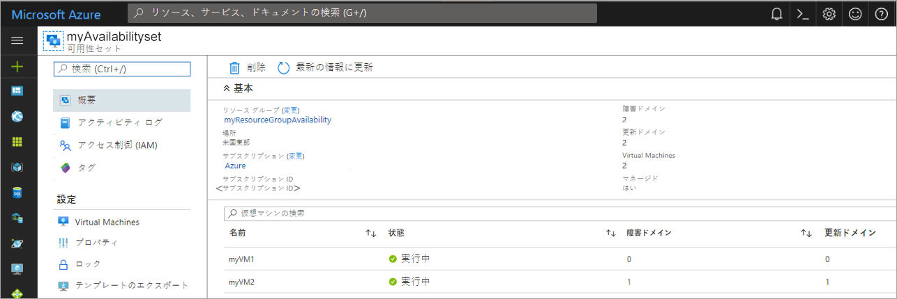

# ミニラボ: 可用性セット内に VM を作成する

## 前提条件

このミニラボの前に、環境変数 `AdminPassword`を事前に設定する必要があります。それを行うには、

1. Azure portal の上部ナビゲーションから Cloud Shell を起動する

    

    * アイコンが狭い画面の上部のメニュー バーに表示されない場合は、省略記号 (..) ボタンを選択します。

        ![[省略] ボタン アイコン](../../Linked_Image_Files/three-points.png)

    * 「**ストレージがマウントされていない**」というメッセージが表示されたら 、デフォルトの選択を維持し、「**ストレージの作成**」 をクリックします (ストレージの作成には数秒かかることがあります)   

1. Cloud Shell が開いたら、シェル ウィンドウの左側の環境ドロップダウンに **Bash** と表示されていることを確認します。

    

    * 「Bash」と表示されない場合は、クリックして `Bash` を選択します。確認する

1. Bash の準備ができたら、自分のパスワードを使用して次のコマンドを入力してください

    `
    AdminPassword="myStr0ngPW%%"
    `

    > *myStr0ngPW%%* を好みの秘密値に変更し、パスワードの長さは 12 ～ 72 文字で、小文字が 1 文字、大文字 1 文字、数字 1 文字、特殊文字 1 文字である必要があります。  
    
1. 次のコマンドを使用して、環境変数を設定したことを確認します。

    `
    echo $AdminPassword
    `


## 可用性セットの作成

1. リソース グループを作成するには、次のコマンドを実行します。 

    `az group create --name myResourceGroup --location eastus`

1. 次のコマンドを実行して、管理可用性セットを作成します。 

    `az vm availability-set create --resource-group myResourceGroup --name myAvailabilitySet --platform-fault-domain-count 2 --platform-update-domain-count 2`
    * これには数秒かかる場合があります

## 可用性セット内に VM を作成する

VM は、ハードウェア全体に正しく分散されるように、可用性セット内に作成する必要があります。作成後、既存の VM を可用性セットに追加することはできません。

> az vm create を使用して VM を作成する場合は、 --availability-set パラメーターを使用して可用性セットの名前を指定します。

1. 次のコマンドを実行して、2 つの仮想マシンを作成します。

    ```
    for i in `seq 1 2`; do
    az vm create \
        --resource-group myResourceGroup \
        --name myVM$i \
        --availability-set myAvailabilitySet \
        --vnet-name MyVnet --subnet subnet1 \
        --image debian \
        --admin-password $AdminPassword \
        --admin-username azureuser \
        --no-wait
    完了
    ```

1. 両方の VM の作成と構成には数分かかります。完了すると、基になるハードウェア全体に 2 つの仮想マシンが分散されます。

1. ウィンドウの上部にある検索バーに 「**リソース グループ**」 を書き込み、その名前のサービスを選択します。 

1. 「リソース グループ」 ビューで 「**myResourceGroup**」 を選択します。

1. `myResourceGroup` に含まれるリソースから。**myAvailabilitySet** の選択

1. VM が 2 つの障害ドメインと更新ドメインに分散される様子を確認してください。

    

## デプロイのクリーン アップ

1. 次のコマンドを実行して、リソース グループ、VM、およびすべての関連リソースを削除します。`az group delete --name myResourceGroup --yes`

    * コンソールが終了するまでしばらく時間がかかる場合があります
