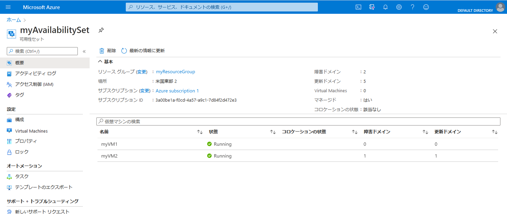

# ミニラボ: 可用性セット内に VM を作成する

## 前提条件

このミニラボの前に、次の前提条件が満たされていることを確認します。

- 事前に環境変数を設定します。 **AdminPassword="myStr0ngPW%%"**

## 可用性セットの作成

1. Azure portal の上部ナビゲーションから Cloud Shell を起動する

    

1. シェルウィンドウの左側の環境ドロップダウンに **Bash** と表示されていることを確認します。

    

1. 次のコマンドを実行して、リソース グループを作成します。`az group create --name myResourceGroup --location westus`

1. 次のコマンドを実行して、管理可用性セットを作成します。`az vm availability-set create --resource-group myResourceGroup --name myAvailabilitySet --platform-fault-domain-count 2 --platform-update-domain-count 2`

## 可用性セット内に VM を作成する

VM は、ハードウェア全体に正しく分散されるように、可用性セット内に作成する必要があります。作成後、既存の VM を可用性セットに追加することはできません。
az vm create を使用して VM を作成する場合は、 --availability-set パラメーターを使用して可用性セットの名前を指定します。

1. 次のコマンドを実行して、2 つの仮想マシンを作成します。

    ```
    for i in `seq 1 2`; do
    az vm create \
        --resource-group myResourceGroup \
        --name myVM$i \
        --availability-set myAvailabilitySet \
        --vnet-name MyVnet --subnet subnet1 \
        --image debian \
        --admin-password $AdminPassword \
        --admin-username azureuser \
        --no-wait
    done
    ```

1. 両方の VM の作成と構成には数分かかります。完了すると、基になるハードウェア全体に 2 つの仮想マシンが分散されます。

1. Azure portal で、 「**リソースグループ**」  >  「**myResourceGroupAvailability**」  >  「 **myAvailabilitySet**」 に移動し、可用性セットを確認します。VM が 2 つの障害ドメインと更新ドメインに分散される様子を確認する必要があります。

    

## デプロイのクリーンアップ

1. 次のコマンドを実行して、リソース グループ、VM、およびすべての関連リソースを削除します。`az group delete --name myResourceGroup --yes`
