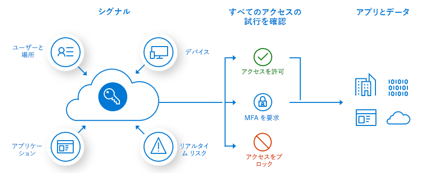
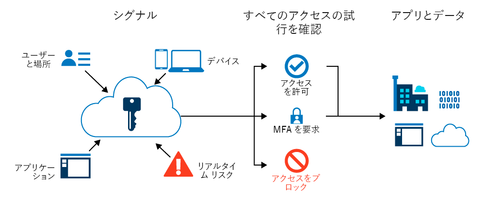
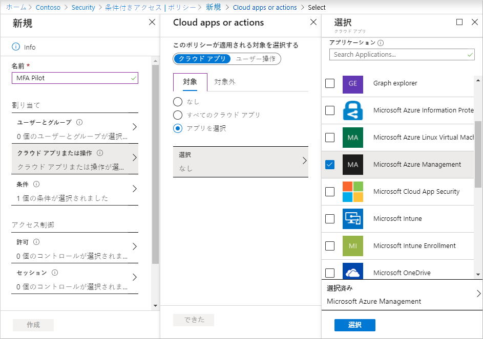
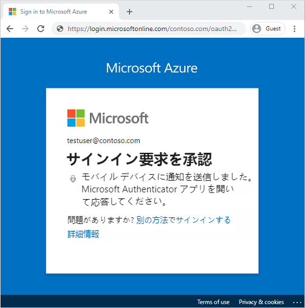

# ミニラボ: Azure Multi-Factor Authentication を使用したユーザー サインイン イベントを保護する

Multi-Factor Authentication (MFA) は、サインイン イベント中にユーザーに対して、追加の識別形式を求めるメッセージが表示されるプロセスです。ユーザーは、携帯電話にコードを入力するか、指紋スキャンを提供するように求められる場合があります。2 番目の認証形式を要求すると、攻撃者が取得または複製することが容易ではないため、セキュリティが強化されます。

Azure Multi-Factor Authentication ポリシーと条件付きアクセス ポリシーを使用すると、特定のサインイン イベント中にユーザーの MFA を有効にする柔軟性が提供されます。

**前提条件**

このミニラボを実行するには、次のリソースと権限が必要です。

* Azure AD Premium または試用ライセンスが有効になっている Azure AD テナント。 

* グローバル管理者権限を持つアカウント。

* テストユーザーなど、知っているパスワードを持つ管理者以外のユーザー。このミニラボでは、このアカウントを使用してエンド ユーザーの Azure Multi-Factor Authentication エクスペリエンスをテストします。 

* 管理者以外のユーザーがメンバーであるグループ (MFA-Test-Group など)。このミニラボでは、このグループの Azure Multi-Factor Authentication を有効にします。 

## 条件付きアクセス ポリシーの作成

Azure Multi-Factor Authentication を有効にして使用する推奨される方法は、条件付きアクセス ポリシーを使用することです。条件付きアクセスでは、サインイン イベントに対応するポリシーを作成および定義し、ユーザーにアプリケーションまたはサービスへのアクセスが許可される前に追加のアクションを要求できます。

このミニラボでは、ユーザーが Azure portal にサインインしたときに MFA を要求する基本的な条件付きアクセス ポリシーを作成します。 

最初に、条件付きアクセス ポリシーを作成し、次のようにユーザーのテスト グループを割り当てます。

1. グローバル管理者アカウントを使用して [Azure portal](https://portal.azure.com/) にサインインします。

2. [**Azure Active Directory**」 を検索して選択し、 [**セキュリティ**」 を選択します。

3. [**条件付きアクセス**」 を選択し、 [**+ 新しいポリシー**」 を選択します。

4. *MFA パイロット*などのポリシーの名前を入力します。

5. [**割り当て**」 で、 [**ユーザーとグループ**」 を選択し、 [**ユーザーとグループの選択**」 をクリックします。

6. [**ユーザーとグループ**」 のチェック ボックスをオンにし、 [**選択**」 をクリックします。

7. [*MFA-Test-Group*」 などの Azure AD グループを参照して選択し、 [**選択**」 を選びます。

    

8. グループに条件付きアクセス ポリシーを適用するには、 「**完了**」 を選択します。

## Multi-Factor Authentication の条件を構成する

条件付きアクセス ポリシーが作成され、ユーザーのテスト グループが割り当てられていると、ポリシーをトリガーするクラウド アプリまたはアクションを定義できるようになります。これらのクラウド アプリまたはアクションは、MFA のプロンプトを表示するなど、追加の処理が必要であると判断したシナリオです。 

ユーザーが Azure portal にサインインするときに MFA を要求するように条件付きアクセス ポリシーを構成します。

1. 「**クラウド アプリまたはアクション**」 を選択します。条件付きアクセス ポリシーを 「*すべてのクラウド アプリ*」 または 「*アプリの選択*」 に適用できます。

1. 「**含める**」 ページで、 「**アプリの選択**」 を選択します。

2. 「**選択**」 を選び、使用可能なサインイン イベントの一覧を参照します。

1. 「**Microsoft Azure 管理**」 を選択して、ポリシーが Azure portal へのサインイン イベントに適用されるようにします。

3. 選択したアプリを適用するには、 「**選択**」 を選び、 「**完了**」 を選択します。

    

1. アクセス制御を使用すると、承認されたクライアント アプリが必要な場合や、Hybrid Azure AD が参加しているデバイスの使用など、ユーザーにアクセスを許可する要件を定義できます。Azure portal へのサインイン イベント中に MFA を要求するようにアクセス制御を構成します。

1. 「**アクセス制御**」 で 「**許可**」 を選択し、 「**アクセスを許可する**」 が選択されていることを確認します。

2. 「**多要素認証が必要**」 のチェック ボックスをオンにして、 「**選択**」 を選びます。

    条件付きアクセス ポリシーは、構成がユーザーに与える影響を確認する場合は 「レポートのみ」 に設定し、ポリシーを今すぐ使用しない場合は 「オフ」 に設定できます。このデモの対象となるユーザーのテスト グループが作成されたため、ポリシーを有効にしてから Azure Multi-Factor Authentication をテストしましょう。

1. 「*ポリシーの有効化*」 を 「**オン**」 に設定します。

2. *条件付きアクセス ポリシー*を適用するには、 「**作成**」 を選択します。

## Azure Multi-Factor Authentication をテストする

条件付きアクセス ポリシーと Azure Multi-Factor Authentication を表示するには、次のように MFA を必要としないリソースにサインインします。

1. InPrivate またはシークレット モードで新しいブラウザーの画面を開き、[ https://account.activedirectory.windowsazure.com ](https://account.activedirectory.windowsazure.com/)にアクセスします。

2. testuser など、管理者以外のテスト ユーザーでサインインします。MFA を完了するためのプロンプトはありません。

3. ブラウザウィンドウを閉じます。

    次に、Azure portal にサインインします。Azure portal は、追加の検証を必要とする条件付きアクセス ポリシーで構成されているため、Azure Multi-Factor Authentication のダイアログが表示されます。

1. InPrivate またはシークレット モードで新しいブラウザーの画面を開き、[https://portal.azure.com](https://portal.azure.com/) にアクセスします。

2. testuser など、管理者以外のテスト ユーザーでサインインします。Azure Multi-Factor Authentication に登録して使用する必要があります。プロンプトに従ってプロセスを完了し、Azure portal に正常にサインインしたことを確認します。

    

 
