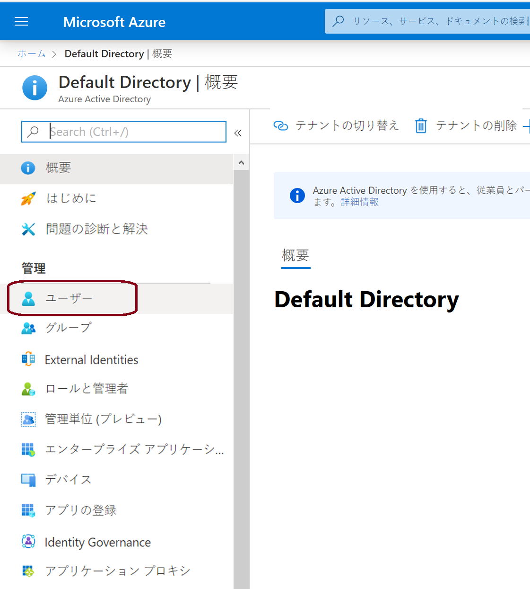
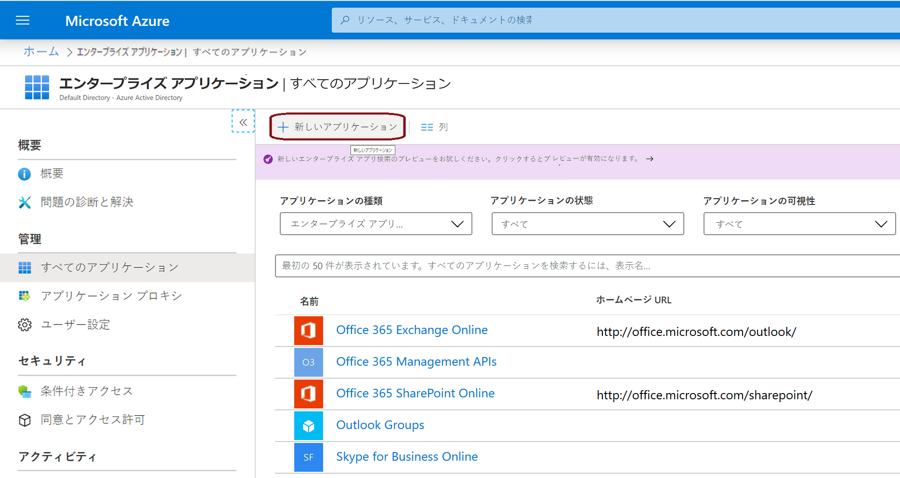
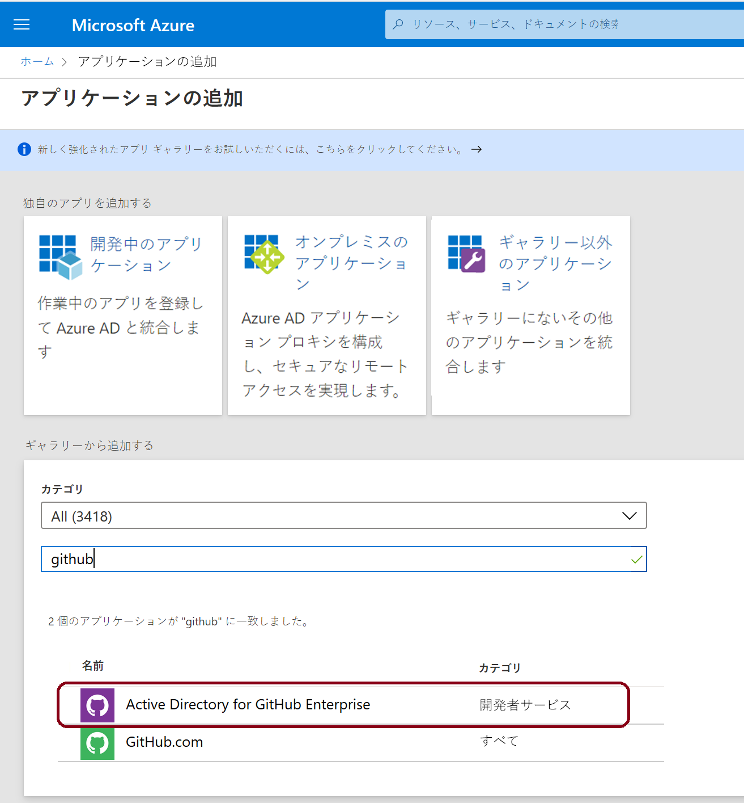
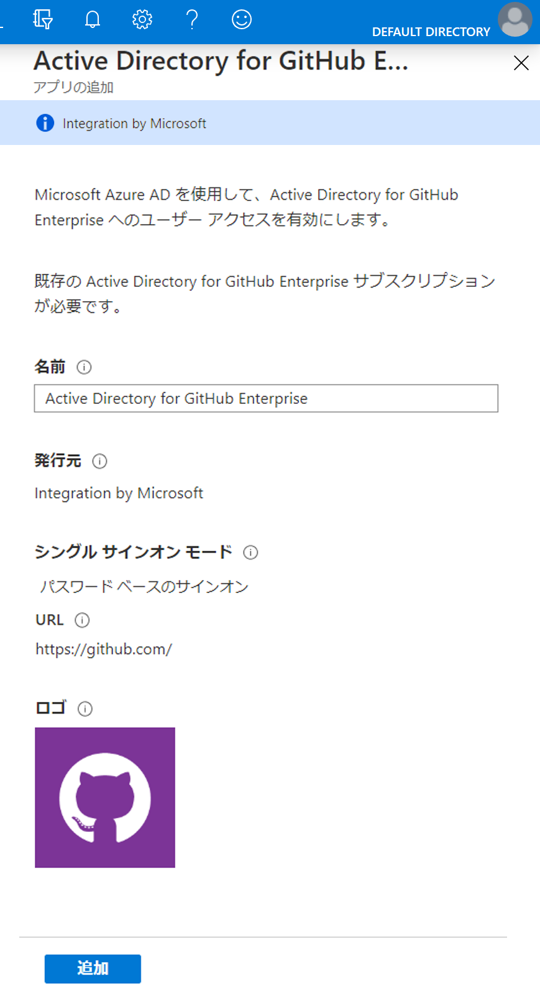
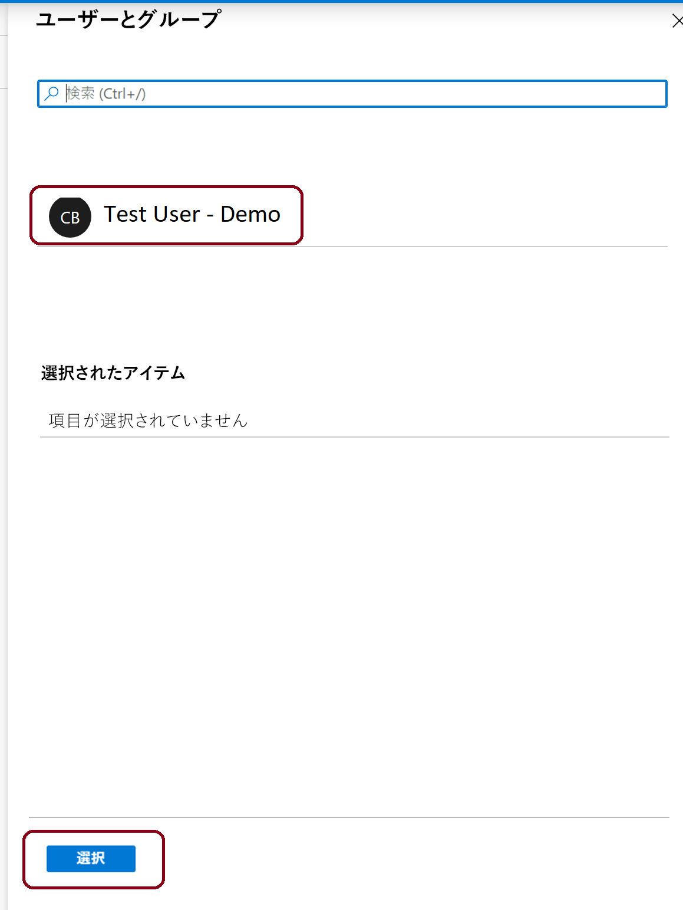
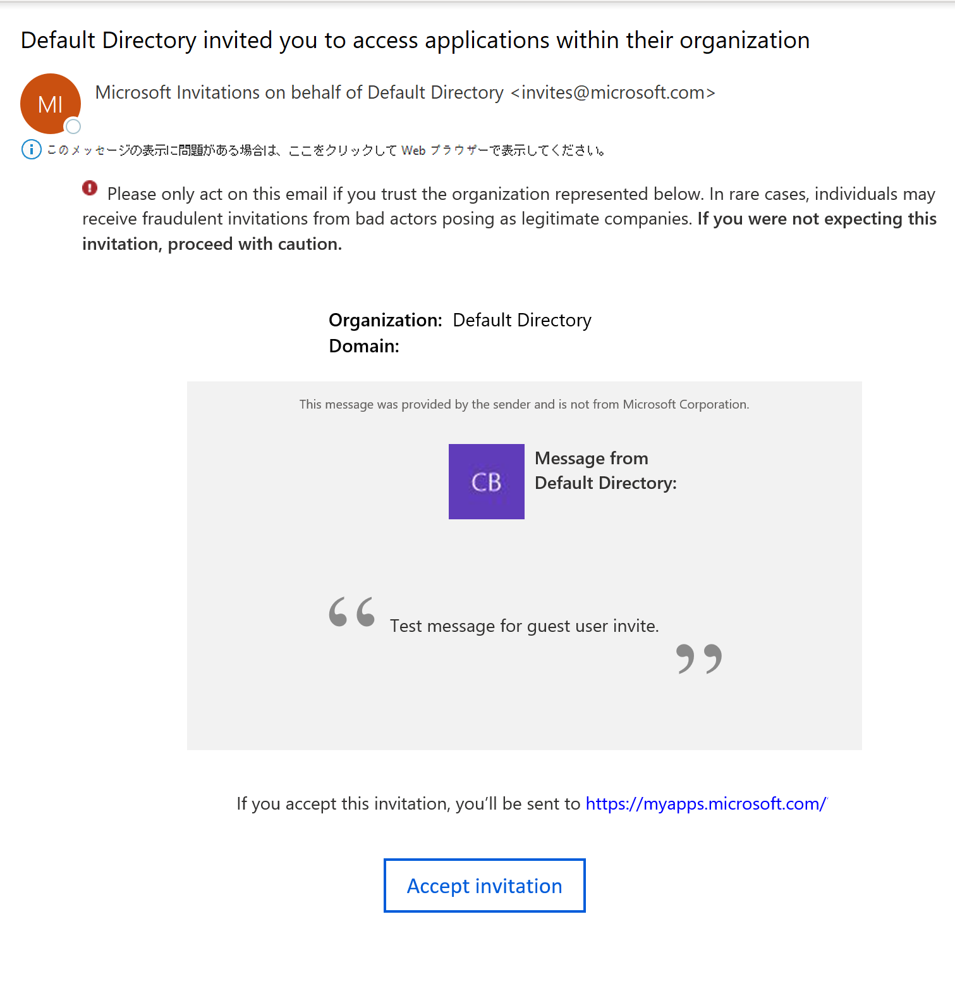

# ミニラボ: Azure portal で Azure AD にゲスト ユーザーを追加する

組織とコラボレーションするユーザーをゲスト ユーザーとしてディレクトリに追加することで、そのユーザーを招待できます。次に、引き換えリンクを含む招待メールを送信するか、共有するアプリへの直接リンクを送信します。 

ゲスト ユーザーは、自分の職場、学校、またはソーシャルの ID を使用してサインインできます。

このミニラボでは、新しいゲスト ユーザーを Azure AD に追加し、招待状を送信します。

## 前提条件

このミニラボでシナリオを完了するには、次のものが必要です。

* グローバル管理者のロールや制限付き管理者ディレクトリのロールなど、テナント ディレクトリにユーザーを作成できるようにするロール。

* テナント ディレクトリに追加でき、テスト招待メールの受信に使用できる有効なメール アカウント。

## ゲスト ユーザーを Azure AD に追加する

1. [Azure portal](https://portal.azure.com/) に管理者としてログインします。

1. 左側のペインから、「**Azure Active Directory** 」 を選択します。

1. 左側にある 「**管理** 」 の左側のパネルで、「**ユーザー** 」 を選択します。

    

1. トップ バーで 「**新しいゲスト ユーザー**」 を選択します

    ![[新しいゲスト ユーザー] オプションを選択する場所を示すスクリーンショット](../../Linked_Image_Files/guest_user_image2.png)

1. 「**新しいユーザー** 」 ページで、「**ユーザーを招待** 」 を選択して、ゲスト ユーザーの情報を追加します。

    ![[新しいゲスト ユーザー] オプションを選択する場所を示すスクリーンショット](../../Linked_Image_Files/guest_user_image3.png)

    - ***ID***
        - **名前:** ゲスト ユーザーの姓名。

        - **メール アドレス (必須):** ゲスト ユーザーのメール アドレス。

    - ***個人的なメッセージ (オプション):*** ゲスト ユーザーへの個人的なウェルカム メッセージを含めます。

    - ***グループと役割*** 
    
        - **グループ:** ゲスト ユーザーを 1 つ以上の既存のグループに追加することも、後で追加することもできます。

        - **ディレクトリ ロール:** ユーザーに Azure AD 管理権限が必要な場合は、管理権限を Azure AD ロールに追加できます。
    - ***設定***
        - **サインインをブロックする (オプション):** プロフィールを削除せずに、ユーザーのサインインを禁止できます 
        - **使用場所 (オプション):** ユーザーの物理的な場所
    - ***求人情報***
        - **役職 (オプション)**
        - **部署 (オプション)**

1. 「**招待する**」 を選択すると、ゲスト ユーザーに招待状を自動的に送信します。右上に通知が表示され、「ユーザーを招待しました」というメッセージが表示されます。

1. 招待状を送信すると、ユーザー アカウントがゲストとしてディレクトリに自動的に追加されます。

## アプリをゲスト ユーザーに割り当てる

*GitHub Enterprise の Active Directory* アプリをテスト テナントに追加し、テスト ゲスト ユーザーをアプリに割り当てます。

1. Azure portal に Azure AD 管理者としてサインインします。

1. 左側のペインで、「**エンタープライズ アプリケーション** 」 を選択します。
    - または、ページ上部の検索ボックスで検索することもできます

1. 「**新しいアプリケーション**」 を選択します。

    

1. 「**ギャラリーから追加**」 の下で、**GitHub** を検索してから、「**GitHub Enterprise の Active Directory** 」 を選択します。

    

1. 「**追加**」 (または 「作成 」) を選択します。新しいウィンドウが表示されます

    

1. 「管理 」 左側のペインで 「シングル **サインオン**」 を選択し、「**シングル サインオン モード**」 で 「**パスワードベースのサインオン**」 を選択して、「**保存**」 をクリックします。

1. 「**管理** 」 の左側のペインで、「**ユーザーとグループ 」 > 「ユーザーの追加**」 を選択します。

1.  「**ユーザー**」 をクリックすると、右側のペインが表示されるので、追加するユーザーをクリックし、ユーザーは 「**選択**」 をクリックします。

    

1. 「**割り当て**」 を選択します。

## ゲスト ユーザーの招待を受け入れる

ゲスト ユーザーのメール アカウントにサインインして、招待状を表示します。

1. テスト ゲスト ユーザーのメール アカウントにサインインします。

1. 受信トレイで、「*招待されました*」というメールを探します。

1. メール本文で、「はじめに 」 を選択します。ブラウザで 「権限の確認 」 ページが開きます。

1. 「**招待を承認**」 を選択します。アクセス パネルが開き、ゲスト ユーザーがアクセスできるアプリケーションが一覧表示されます。

    
