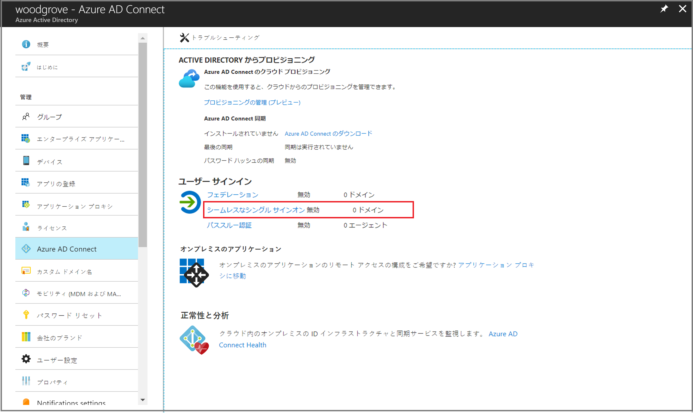

# ミニラボ: Azure Active Directory のシームレスなシングル サインオン

 

Azure Active Directory (Azure AD) シームレス シングル サインオン (シームレス SSO) は、企業ネットワークに接続されている企業デスクトップ上にいるユーザーに自動的にサインインします。シームレスな SSO により、ユーザーは、オンプレミスのコンポーネントを追加しなくても、クラウドベースのアプリケーションに簡単にアクセスできます。

## 前提条件

このミニラボの前に、次の前提条件が満たされていることを確認します。

* **Azure AD Connect サーバーをセットアップ**: サインイン方法としてパススルー認証を使用する場合は、前提条件の確認を追加する必要はありません。サインイン方法としてパスワード ハッシュ同期を使用する場合、Azure AD Connect と Azure AD の間にファイアウォールがある場合は、次の点を確認してください。

	* Azure AD Connect のバージョン 1.1.644.0 以降を使用します。
	
	* ファイアウォールまたはプロキシで DNS ホワイトリスト登録が許可されている場合は、ポート 443 経由で *.msappproxy.net URL への接続をホワイトリストに登録します。 

* **ドメイン管理者の資格情報を設定**: 次の Active Directory のフォレストごとにドメイン管理者の資格情報が必要です。

	* Azure AD Connect を使用して Azure AD に同期します。
	
	* シームレス SSO を有効にするユーザーが含まれています。

## Azure AD Connect を有効にする

[Azure AD Connect](https://docs.microsoft.com/ja-jp/azure/active-directory/hybrid/whatis-hybrid-identity) を使用してシームレスな SSO を有効にします。 

Azure AD Connect の新規インストールを行う場合は、[[カスタム インストール パス](https://docs.microsoft.com/ja-jp/azure/active-directory/hybrid/how-to-connect-install-custom)] を選択します。 「**ユーザー サインイン**」 ページで、 **「シングル サインオンを有効にする」 オプション**をオンにします。   

Azure AD Connect がインストール済みの場合は、「Azure AD Connect」 の 「**ユーザー サインインの変更**」 ページを選択し、 「**次へ**」 を選択します。   

**「シングル サインオンを有効にする」** ページが表示されるまで、ウィザードを続行します。次の操作を行う各 Active Directory フォレストのドメイン管理者の資格情報を指定します。

* Azure AD Connect を使用して Azure AD に同期します。

* シームレス SSO を有効にするユーザーが含まれています。

ウィザードの完了後、テナントでシームレス SSO が有効になります。

## シームレス SSO が有効になっていることを確認する

シームレス SSO が正しく有効になっていることを確認するには、以下の手順に従います。

1. テナントのグローバル管理者の資格情報を使用して [Azure Active Directory 管理センター](https://aad.portal.azure.com/) にサインインします。

2. 左側のペインで **「Azure Active Directory」** を選択します。

3. **「Azure AD Connect」** を選択します。

4. シームレス シングル サインオン機能が *「有効」* と表示されていることを確認します。

>重要

シームレス SSO は、各 AD フォレストのオンプレミスの Active Directory (AD) に AZUREADSSOACC という名前のコンピューター アカウントを作成します。AZUREADSSOACC コンピューター アカウントは、セキュリティ上の理由から強力に保護する必要があります。ドメイン管理者のみがコンピューター アカウントを管理できる必要があります。コンピューター アカウントの Kerberos 委任が無効になっており、Active Directory の他のアカウントが AZUREADSSOACC コンピューター アカウントに対する委任アクセス許可を持っていないかどうかを確認します。コンピューター アカウントを組織単位 (OU) に格納し、誤って削除されないようにし、ドメイン管理者だけがアクセスできる場所に保管します。
