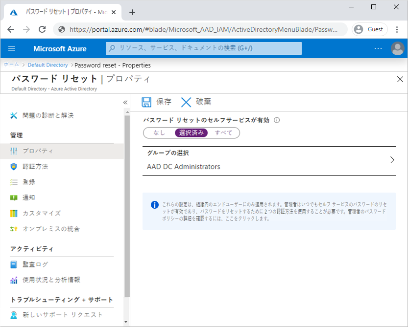
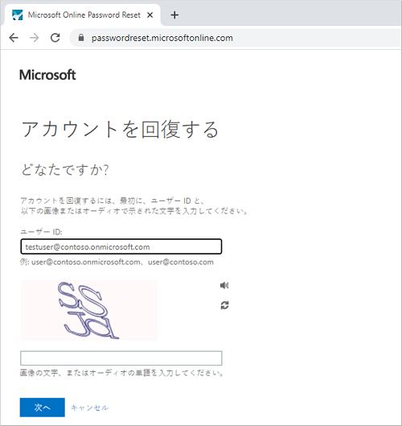

# ミニラボ: Azure AD パスワード リセットのセルフサービスを有効にする

Azure Active Directory (Azure AD) のパスワード リセットのセルフサービス (SSPR) を使用すると、ユーザーは管理者やヘルプ デスクに関与していない状態でパスワードを変更またはリセットできます。ユーザーのアカウントがロックされている場合、またはパスワードを忘れた場合は、メッセージに従ってブロックを解除して作業に戻ることができます。この機能により、ユーザーがデバイスやアプリケーションにサインインできない場合のヘルプ デスクへの問い合わせや生産性の低下が軽減されます。

このトピックでは、パスワード リセットのセルフサービスを有効にする方法を示します。 

* Azure AD ユーザーのグループに対してパスワード リセットのセルフサービスを有効にする

* 認証方法と登録オプションを構成する

* ユーザーとしての SSPR プロセスのテスト

## 前提条件

このミニラボを完了するには、次のリソースと権限が必要です。

* 少なくとも試用ライセンスが有効になっている、作業用の Azure AD テナント。 

* グローバル管理者特権を持つアカウント。

* テストユーザーなど、知っているパスワードを持つ管理者以外のユーザー。このミニラボでは、このアカウントを使用してエンドユーザー SSPR エクスペリエンスをテストします。 

* 管理者以外のユーザーが SSPR テスト グループなどのメンバーであるグループ。このミニラボでは、このグループの SSPR を有効にします。 

## パスワード リセットのセルフサービスを有効にする

Azure AD では、SSPR を 「なし」、「選択済み」、または 「すべてのユーザー」 に対して有効にできます。この細分化された機能により、SSPR 登録プロセスとワークフローをテストするユーザーのサブセットを選択できます。このプロセスに慣れ、より広範なユーザーのセットで要件を伝えることができる場合は、SSPR を有効にする追加のユーザー グループを選択できます。または、Azure AD テナントのすべてのユーザーに対して SSPR を有効にできます。

このミニラボでは、テスト グループ内のユーザーのセットに対して SSPR を構成します。次の例では、グループ SSPR-Test-Group が使用されます。必要に応じて、独自の Azure AD グループを提供します。

1. グローバル管理者アカウントを使用して [Azure portal](https://portal.azure.com/) にサインインします。

2. **Azure Active Directory** を検索して選択し、左側のメニューから 「**パスワードのリセット**」 を選択します。

3. 「**プロパティ**」 ページの 「パスワード リセットのセルフサービスが有効」 オプションの下で、 「**グループの選択**」 を選択します。

4. *SSPR-Test-Group* などの Azure AD グループを参照して選択し、 「**選択**」 を選択します。

    

    SSPR のより広範なデプロイの一部として、入れ子になったグループがサポートされます。選択したグループのユーザーに適切なライセンスが割り当てられていることを確認します。現在、これらのライセンス要件の検証プロセスはありません。

5. 選択したユーザーの SSPR を有効にするには、 「**保存**」 を選択します。

## 認証方法と登録オプションの選択

ユーザーがアカウントのロックを解除したり、パスワードをリセットしたりする必要がある場合は、追加の確認方法を求めるプロンプトが表示されます。この追加の認証要素により、承認された SSPR イベントのみが完了します。ユーザーが提供する登録情報に基づいて、許可する認証方法を選択できます。

1. 左側のメニューの 「**認証方法**」 ページで、 「**リセットに必要なメソッドの数**」 を *1* に設定します。

    セキュリティを強化するために、SSPR に必要な認証方法の数を増やすことができます。

2. 組織で許可する**ユーザーが使用できるメソッド**を選択します。このミニラボでは、次の方法を有効にするチェック ボックスをオンにします。

    - *モバイル アプリの通知*

    - *モバイル アプリのコード*

    - *メール*

    - *携帯電話*

    - *会社電話*

3. 認証方法を適用するには、 「**保存**」 を選択します。

    ユーザーが自分のアカウントのロックを解除したり、パスワードをリセットしたりするには、連絡先情報を登録する必要があります。この連絡先情報は、前の手順で構成したさまざまな認証方法に使用されます。

    管理者は、この連絡先情報を手動で提供するか、ユーザーが登録ポータルにアクセスして情報を提供することもできます。このミニラボでは、ユーザーが次回サインインするときに登録を求めるプロンプトを表示するように構成します。

1. 左側のメニューの 「**登録**」 ページで、 「**サインイン時にユーザーに登録を要求する**」 で 「はい」 を選択します。

2. 連絡先情報を最新の状態に保つことが重要です。SSPR イベントの開始時に連絡先情報が古い場合、ユーザーはアカウントのロックを解除したり、パスワードをリセットしたりすることができない可能性があります。

1. 「**ユーザーが認証情報を再確認するように求められるまでの日数**」 を *180* に設定します。

3. 登録設定を適用するには、 「**保存**」 を選択します。

## 通知とカスタマイズの構成

アカウントの利用状況についてユーザーに通知するために、SSPR イベントが発生したときに電子メール通知を送信するように構成できます。これらの通知は、通常のユーザー アカウントと管理者アカウントの両方を対象にできます。管理者アカウントの場合、この通知は、特権管理者アカウントのパスワードが SSPR を使用してリセットされたときに認識の追加レイヤーを提供します。

1. 左側のメニューの 「**通知**」 ページで、次のオプションを構成します。

    - **「パスワードのリセット時にユーザーに通知する」 オプション**を 「*はい*」 に設定します。

    - 「**他の管理者がパスワードをリセットしたときに、すべての管理者に通知する**」 を 「*はい*」 に設定します。

2. 通知設定を適用するには、 「**保存**」 を選択します。

## パスワード リセットのセルフサービスのテスト

SSPR が有効で構成されている場合は、前のセクションで選択したグループに属するユーザー (Test-SSPR-Group など) で SSPR プロセスをテストします。次の例には、testuser アカウントが使用されています。このミニラボの最初のセクションで、SSPR を有効にしたグループの一部である独自のユーザー アカウントを指定します。

>**注**
パスワード リセットのセルフサービスをテストする場合は、管理者以外のアカウントを使用します。管理者は、パスワード リセットのセルフサービスが常に有効であり、2 つの認証方法を使用して自分のパスワードをリセットする必要があります。

1. 手動登録プロセスを表示するには、InPrivate またはシークレット モードで新しいブラウザーの画面を開き、[https://aka.ms/ssprsetup](https://aka.ms/ssprsetup) に移動します。ユーザーを、次回サインインするときにこの登録ポータルに誘導する必要があります。

2. testuser などの管理者以外のテスト ユーザーでサインインし、認証方法の連絡先情報を登録します。

3. 完了したら、 「**Looks good**」 と記されているボタンを選択し、ブラウザーの画面を閉じます。

4. InPrivate モードまたはシークレット モードで新しいブラウザーの画面を開き、[https://aka.ms/sspr](https://aka.ms/sspr) に移動します。

5. testuser、CAPTCHA からの文字など、管理者以外のテスト ユーザーのアカウント情報を入力してから、 「**次へ**」 を選択します。

    

6. 確認手順に従ってパスワードをリセットします。完了すると、パスワードがリセットされたことを示す電子メール通知が届きます。
