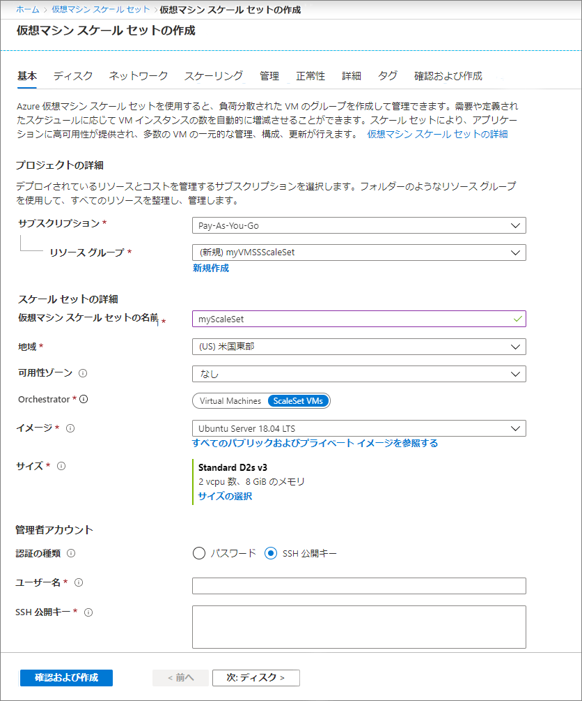

# ミニラボ: Azure Portal で VM スケール セットを作成する

## パブリック ロード バランサーを作成する

ポータルを使用して、パブリック ロード バランサーを作成します。作成する名前とパブリック IP アドレスは、ロード バランサーのフロントエンドとして自動的に構成されます。

1. 検索ボックスに、 「*load balancer*」と入力します。検索結果の 「**マーケットプレイス**」 で 、 「**ロード バランサー**」 を選択します。   

2. 「ロード バランサーの作成」 ページの 「**基本**」 タブで、次の情報を入力または選択します。 

| 設定 	| 値 	|
|------------------------	|-----------------------------------------------------------------	|
| サブスクリプション 	| サブスクリプションを選択します。 	|
| リソース グループ 	| 「新規作成」 を選択して、テキスト ボックスに「myVMSSResourceGroup」と入力します。 	|
| 名前 	| myLoadBalancer 	|
| リージョン 	| 「米国東部」 を選択します。 	|
| 種類 	| 「パブリック」 を選択します。 	|
| SKU 	| 「標準」 を選択します。 	|
| パブリック IP アドレス 	| 「新規作成」 を選択します。 	|
| パブリック IP アドレス名 	| MyPip 	|
| 割り当て 	| Static 	|
| 可用性ゾーン 	| ゾーン冗長 	|

3. 「**確認および作成**」 を選択します。

4. 「**作成**」 を選択します。

## 仮想マシン スケール セットを作成する

Windows サーバー イメージまたは RHEL、CentOS、Ubuntu、SLES などの Linux イメージを使用してスケール セットをデプロイできます。

1. 検索ボックスに「*スケールセット*」と入力します。 結果の 「**Marketplace**」 で、 「**仮想マシン スケール セット**」 を選択します。 「**仮想マシン スケール セットの作成**」 ページが開きます。

2. 「**基本**」 タブの 「**プロジェクトの詳細**」 に、正しいサブスクリプションが選択されていることを確認し、 「**新しいリソース グループの作成**」 を選択します。名前に「*myVMSSResourceGroup*」と入力し、 「OK」 を選択します。

3. スケール セットの名前として、 「*myScaleSet*」と入力します。

4. 「**リージョン**」 で、自分の地域に近いリージョンを選択します。 

5. 「**スケール セット VM**」 で 「**オーケストレーター**」 の既定値はそのままにします。

6. 「**イメージ**」 にマーケットプレースのイメージを選択します。 この例では、Ubuntu Server 18.04 LTS を選択しました。

7. 希望のユーザー名を入力し、希望する認証タイプを選択します。

    - **パスワード**は 12 文字以上で、1 つの小文字、1 つの大文字、1 つの数字、および 1 つの特殊文字の 4 つの複雑さの要件のうち 3 つを満たす必要があります。 

    - Linux OS ディスク イメージを選択する場合は、代わりに 「**SSH 公開鍵**」 を選択できます。 ~/.ssh/id_rsa.pub などの公開鍵のみを提供します。ポータルから Azure Cloud Shell を使用して、SSH キーを作成して使用できます。

    

8. 「**次へ**」 を選択して、他のページを移動します。  各タブを調べる際に、作成するスケール セット内の VM の属性を確認します。

9. 「**インスタンス**」 タブと 「**ディスク**」 タブを確認しますが、既定値はそのままにしておきます。  

10. 「**ネットワーク**」 ページの 「**負荷分散**」 で、 「**はい**」 を選択してスケール セット インスタンスをロード バランサーの背後に配置します。     

11. 「**負荷分散オプション**」 で、 「**Azure Load Balancer**」 を選択します。   

12. 「**ロード バランサーの選択**」 で、先ほど作成した 「**myLoadBalancer**」 を選択します。  

13. **バックエンド プールの選択**には、 「**新規作成**」 を選択し、「*myBackendPool*」と入力して、 「**作成**」 を選択します。

1. 「**スケーリング**」 タブと 「**管理**」 タブの既定値を調べます

14. 「**確認および作成**」 を選択します。

15. 「**作成**」 を選択して、スケール セットをデプロイします。

 ## リソースをクリーン アップする

 不要になった場合は、リソース グループ、スケール セット、およびすべての関連リソースを削除します。そのためには、スケール セットのリソース グループを選択し、 「**削除**」 を選択します。
