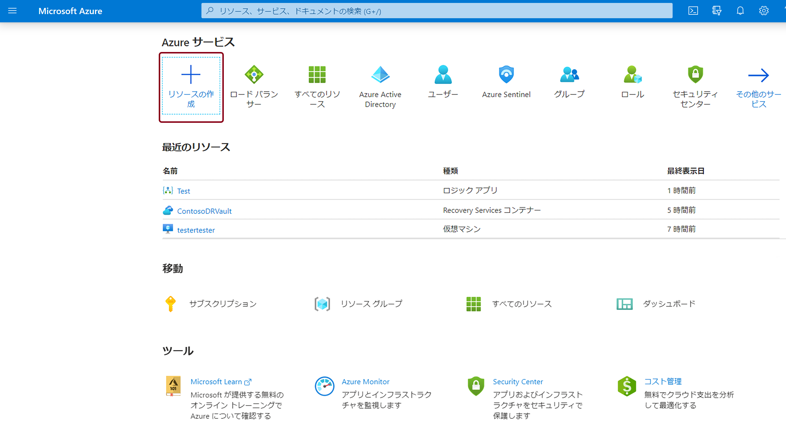
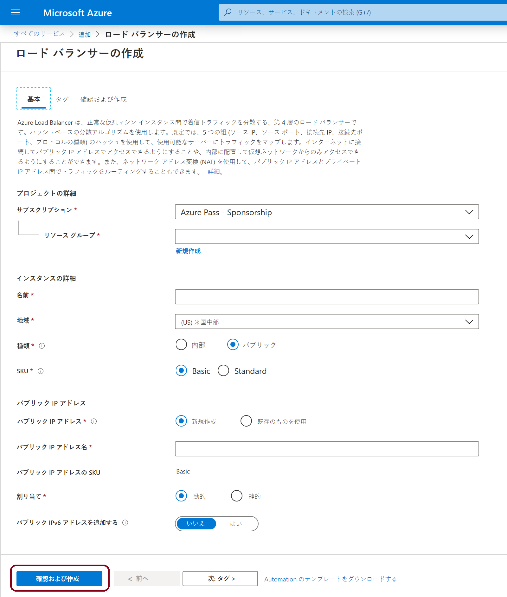
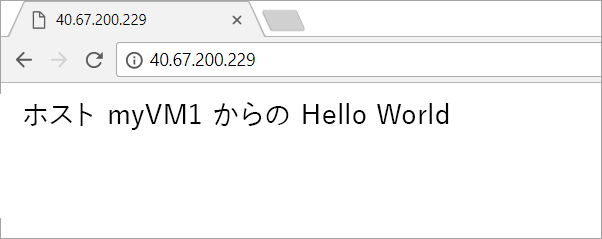

# ミニラボ: VM のロード バランシングを行うロード バランサーを作成する

Azure portal [(https://portal.azure.com)](https://portal.azure.com/) にサインインします。

## 負荷分散装置の作成

このミニラボでは、Virtual Machines の負荷分散に役立つロード バランサーを作成します。パブリック ロード バランサーまたは内部ロード バランサーを作成できます。パブリック ロード バランサーを作成するときは、ロード バランサーのフロントエンド (デフォルトではLoadBalancerFrontendという名前) として構成された新しいパブリック IP アドレスも作成する必要があります。

1. 「**+ リソースの作成**] を選択し、 「*ロード バランサー*] と入力します。

。

2. 「**作成**」 を選択します。

![Standard Load Balancer を作成し、 [**作成**] を選択します](../../Linked_Image_Files/create-load-balancer-start.png)。

3. 「**ロード バランサーの作成**」 ページの 「**基本**」 タブで、次の情報を入力または選択し、残りの設定のデフォルトを承認してから、 「**Review + create**」 を選択します。

。

| 設定 | 値 |
|------------------------|---------------------------------------------------------------------------------------------------------------------------------------------------------------------------------------------------------------|
| サブスクリプション | サブスクリプションを選択します。 |
| リソース グループ | 「**新規作成**」 を選択して、テキスト ボックスに *myResourceGroupSLB* と入力します。 |
| 名前 | *myLoadBalancer* |
| リージョン | **西ヨーロッパ**を選択します。 |
| 種類 | **パブリック** を選択します。 |
| SKU | **Standard** または **Basic** を選択します。Microsoft では、運用ワークロードの Standard を推奨します。 |
| パブリック IP アドレス | 「**新規作成**」 を選択します。使用を希望する既存のパブリック IP がある場合は、 「**既存のものを使用**」 を選択します |
| パブリック IP アドレス名 | テキスト ボックスに *myPublicIP* と入力します。   ```-SKU Basic``` を使用して、基本パブリック IP を作成します。基本パブリック IP は、 **Standard** Load Balancer と互換性がありません。Microsoft では、 運用ワークロードに **Standard** を使用することをお勧めします。 |
| 可用性ゾーン | 「*ゾーン冗長*」と入力して、回復性があるロード バランサーを作成します。ゾーン ロード バランサーを作成するには、1、2、または 3 から特定のゾーンを選択します。 |

>**重要**
このミニラボは、上記の SKU 選択プロセス中に Standard SKU が選択されていることを前提としています。


## 負荷分散装置のリソースの作成

このセクションでは、バックエンド アドレス プールと正常性プローブのロード バランサー設定を構成し、バランサー規則を指定します。

## バックエンド プールの作成

VM にトラフィックを分散するために、バックエンド アドレス プールには、ロード バランサーに接続されている仮想 NIC の IP アドレスが含まれます。バックエンド アドレス プール myBackendPool を作成し、インターネット トラフィックの負荷分散用の Virtual Machines を含めます。

1. 左側のメニューから 「**すべてのサービス**」 を選択し、 「**すべてのリソース**」 を選択して、リソースリストから 「**myLoadBalancer**」 を選択します。

2. 「**設定**」 で、 「**バックエンド プール**」 を選択し、 「**追加**」 を選択します。

3. 「**バックエンド プールの追加**」 ページで、名前にバックエンド プールの名前として「*myBackendPool*」と入力し、 「**追加**」 を選択します。

## 正常性プローブを作成する

ロード バランサーでアプリの状態を監視するには、正常性プローブを使用します。正常性プローブは動的に、正常性チェックへの応答に基づいて、VM を追加したり、ロード バランサーのローテーションから削除したりします。正常性プローブ myHealthProbe を作成し、VM の正常性を監視します。

1. 左側のメニューから 「**すべてのサービス**」 を選択し、 「**すべてのリソース**」 を選択して、リソース リストから 「** myLoadBalancer**」 を選択します。

2. 「**設定**」で、 「**正常性プローブ**」 を選択し、 「**追加**」 を選択します。

| 設定 | 値 |
|---------------------|-------------------------------------------------------------------------------------------------------------------------------|
| 名前 | 「*myHealthProbe*」を入力します。 |
| プロトコル | 「**HTTP**」 を選択します。 |
| ポート | 「*80*」を入力します。 |
| サイクル間隔 | プローブ試行間の*サイクル間隔*の数に秒単位で「**15**」を入力します。 |
| 異常なしきい値 | **異常なしきい値**の数、または VMが 異常であると見なされる前に発生する必要のある連続したプローブ障害に、 ** 2 **を選択します。 |


3. 「**OK**」 を選択します。

## ロード バランサー ルールを作成する

ロード バランサー ルールは、VM へのトラフィックの分散方法を定義するために使用されます。受信トラフィック用のフロントエンド IP 構成と、トラフィックを受信するためのバックエンド IP プールを、必要な発信元ポートと宛先ポートと共に定義します。フロントエンドの FrontendLoadBalancer で、ポート 80 を聞き取り、ポート 80 を使用して負荷分散されたネットワーク トラフィックをバックエンド アドレス プール myBackEndPool に送信するための、ロードバランサー ルール myLoadBalancerRuleWeb を作成します。

1. 左側のメニューで 「**すべてのサービス**」 を選択し、 「**すべてのリソース**」 を選択してから、リソース リストから 「**myLoadBalancer**」 を選択します。

2. 「**設定**」 で、 「**負荷分散ルール**」 を選択し、 「**追加**」 を選択します。

3. これらの値を使用して、負荷分散ルールを構成します。

| 設定 | 値 |
|--------------|-----------------------|
| 名前 | 「*myHTTPRule*」 と入力します。 |
| プロトコル | 「**TCP**」 を選択します。 |
| ポート | 「*80*」を入力します。 |
| バックエンド ポート | 「*80*」を入力します。 |
| バックエンド プール | 「**myBackendPool**」 を選択します。 |
| 正常性プローブ | **myHealthProbe** を選択します。 |


4. 残りのデフォルトのままにして、 **OK**を選択します。

## バックエンド サーバーを作成します。

このセクションでは、仮想ネットワークを作成し、負荷分散装置のバックエンド プール用に 3 つの仮想マシンを作成し、仮想マシンに IIS をインストールし、負荷分散装置をテストします。

## 仮想ネットワークとパラメーター

このセクションでは、以下の手順のパラメーターを以下の情報に置き換える必要があります。

| パラメーター | 値 |
|------------------------|--------------------|
| **resource-group-name** | myResourceGroupSLB |
| **virtual-network-name** | myVNet |
| **region-name** | 西ヨーロッパ |
| **IPv4-address-space** | 10.1.0.0\16 |
| **subnet-name** | myBackendSubnet |
| **subnet-address-range** | 10.1.0.0\24 |


## 仮想ネットワークの作成

このセクションでは、仮想ネットワークとサブネットを作成します。

1. 画面の左上で、 **「リソースの作成」 > 「ネットワーク」 > 「仮想ネットワーク」** を選択するか、 検索ボックスで 「*仮想ネットワーク*」 を検索します。   

2. 「**仮想ネットワークの作成**」 で、 「**Basics**」 タブで次の情報を入力または選択します。

| 設定 | 値 |
|------------------|----------------------------------------------------------------------------------------------------------------------------------|
| **プロジェクトの詳細** |  |
| サブスクリプション | Azure サブスクリプションを選択する |
| リソース グループ | 「**新規作成**」 を選択し、 「**resource-group-name**」と入力して 「**OK**」 を選択するか、パラメーターに基づいて既存の 「**resource-group-name**」 を選択します。      |
| **インスタンスの詳細 **|  |
| 名前 | **virtual-network-name** と入力します |
| リージョン | **region-name** を選択します |

3. 「**IP アドレス**」 タブを選択するか、 「**次へ**」 を選択しますページの下部にある 「**IP アドレス**」 ボタン。

4. 「**IPアドレス**」 タブで、次の情報を入力します。 

| 設定 | 値 |
|--------------------|----------------------------|
| IPv4 アドレス空間 | **IPv4-address-space** を入力します |


5. 「**サブネット名**」 で、 「**既定**」 という語を選択します。   

6. 「**サブネットの編集**」 で、次の情報を入力します。

| 設定 | 値 |
|----------------------|------------------------------|
| サブネット名 | **サーバー名** を入力する |
| サブネット アドレス範囲 | **subnet-address-range**を入力してください |


7. **「保存」** を選択します。

8. 「**Review + create** 」 タブを選択するか、 「**Review + create**」 ボタンを選択します。 

9. 「**作成**] を選択します。

## 2 つの仮想マシンを作成する

パブリック IP SKU と負荷分散装置 SKU は一致する必要があります。Standard Load Balancer では、バックエンド プールで標準 IP アドレスを持つ VM を使用します。このセクションでは、3つのVM（* myVM1、myVM2 *および* myVM3 *）を作成し、3 つの異なるゾーン（*ゾーン 1、ゾーン 2 *および* ゾーンに標準のパブリック IP アドレスを設定します。 3 *）先に作成された負荷分散装置のバックエンドプールに後で追加されます。「Basic」 を選択した場合は、基本 IP アドレスを持つ VM を使用します。

1. ポータルの左上で、 **リソースの作成 > 計算 > Windows Server 2019 Datacenter**を選択します。

2. 「**仮想マシンの作成**」 で、 「** Basics **」 タブで次の値を入力または選択します。

- **サブスクリプション > リソース グループ**: **myResourceGroupSLB** を選択します。

- **インスタンスの詳細 > 仮想マシン**名: *myVM1* と入力します

- **インスタンスの詳細 > 地域** > 、 **西ヨーロッパ**を選択します。

- **「インスタンスの詳細」 > 「可用性オプション」** > - 「**可用性ゾーン**」 を選択します。

- **「インスタンスの詳細」 > 「可用性ゾーン」** > **1** を選択します。

- **管理者アカウント** > **ユーザー名、パスワード**、 **パスワードの確認**情報を入力します。   

- 「**ネットワーク**」 タブを選択するか、 「**次へ**」 を選択します**ディスク**、そして**次へネットワーク**

3. 「**ネットワーク**」 タブで、次の項目が選択されていることを確認します。 

- **仮想ネットワーク**: *myVnet*

- **サブネット**: *myBackendSubnet*

- **パブリック IP** > 「**新規作成**」 を選択します。 「**パブリック IP アドレスの作成**」ウィンドウで 、 「**SKU**」 で 「**Standard**」 を選択し、 「**可用性ゾーン**」 で 「**ゾーン冗長**」 を選択し、 「**OK**」 を選択します。Basic ロード バランサーを作成した場合は、「Basic」 を選択します。Microsoft では、運用ワークロードに Standard SKU を使用することをお勧めします。

- ファイアウォールの一種である新しいネットワーク セキュリティ グループ (NSG) を作成するには、 「**ネットワーク セキュリティ グループ**」 の下で 「**詳細**」 を選択します。    

1. 「**ネットワーク セキュリティ グループの構成**」フィールドで、 「**新規作成**」 を選択します。

2. 「*myNetworkSecurityGroup*」と入力し、 「**OK**」 を選択します。   

- VM をロード バランサーのバックエンド プールの一部にするには、次の手順を実行します。 
	
	- 「**負荷分散**」 で、 「**この仮想マシンを既存の負荷分散ソリューションの背後に配置しますか?**」で、 「**はい**」 を選択します。
	
	- 「**負荷分散の設定**」 で、 「**負荷分散オプション**」 で 「**Azure Load Balancer**」 を選択します。
	
	- **ロード バランサーを選択する**場合は、 *myLoadBalancer*。
	
	- 「**管理**」 タブを選択するか、 **「次へ」 > 「管理」** を選択します。

4. 「**管理**」 タブの  「**監視**」 で、 「**ブート診断**」 を 「**オフ**」 に設定します。       

5. 「**確認および作成**」 を選択します。

6. 設定を確認し、 「**作成**」 を選択します。

7. 手順 2 - 6 に従って、次の値と他のすべての設定を *myVM1* と同じ 2 つの追加の VM を作成します。

| 設定 | VM 2 | VM 3 |
|-------------------------------|---------------------------------------------|---------------------------------------------|
| 名前 | *myVM2* | *myVM3* |
| 可用性ゾーン | 120 | 3 |
| パブリック IP | **Standard** SKU | **Standard** SKU |
| パブリック IP - 可用性ゾーン | **ゾーン冗長** | **ゾーン冗長** |
| ネットワーク セキュリティ グループ | 既存の *myNetworkSecurity グループ*を選択する | 既存の *myNetworkSecurity グループ*を選択する |
|  |  |  |


## NSG ルールの作成

このセクションでは、HTTP を使用した着信接続を許可するネットワーク セキュリティ グループ ルールを作成します。

1. 左側のメニューで 「**すべてのサービス**」 を選択します。 「**すべてのリソース**」 を選択し、 リソース一覧から、 「**myNetworkSecurityGroup**」 を選択します。これは、 「**myResourceGroupSLB**」 リソース グループに存在します。

2. 「**設定**」 で、 「**受信セキュリティ規則**」 を選択してから、 「**追加**」 を選択します。 

3. ポート **80** を使用して受信 HTTP 接続を許可するには、 **myHTTPRule** という名前の受信セキュリティ規則に次の値を入力します。    

- **「ソース」**: *サービス タグ*

- **ソース サービス タグ**: *インターネット*

- **宛先ポート範囲**: *62500*

- **プロトコル**: *TCP*

- **アクション**: *許可*

- **優先度**: *100*

- **名前**: *myHTTPRule*

- **説明**: *HTTP を許可する*

4. 「**追加**」 を選択します。

5. 必要に応じて、次の値を使用して、受信 RDP ルールの手順を繰り返します。 

- **宛先ポート範囲**: *3389 と入力します*。

- **優先度**: 「*200*」と入力します。

- **名前**: 「*MyRDPRule*」と入力します。 

- **説明**: 「*RDP を許可する*」と入力します。 

## IIS をインストールする

1. 左側のメニューで 「**すべてのサービス**」 を選択して、 「**すべてのリソース**」 を選択して、リソース リストから 「*myResourceGroupLB*」 リソース グループにある 「**myVM1**」 を選択します。

2. 「**概要**」 ページで、VM への RDP への 「**接続**」 を選択します。

3. この VM の作成中に指定した資格情報を使用して VM にログインします。仮想マシン *- myVM1* とのリモート デスクトップ セッションが起動します。 

4. サーバー デスクトップで、 **「Windows 管理ツール」 > 「Windows PowerShell」** に移動します。 

5. PowerShell ウィンドウで、次のコマンドを実行して IIS サーバーをインストールし、既定の iisstart.htm ファイルを削除し、VM の名前を表示する新しい iisstart.htm ファイルを追加します。

```PowerShell
# IIS サーバー ロールをインストールする
 Install-WindowsFeature -name Web-Server -IncludeManagementTools

 # 既定の htm ファイルを削除する
  remove-item  C:\inetpub\wwwroot\iisstart.htm

 # サーバー名を表示する新しい htm ファイルを追加する
  Add-Content -Path "C:\inetpub\wwwroot\iisstart.htm" -Value $("Hello World from " + $env:computername)
```

6. *myVM1* で RDP セッションを閉じます。

7. 手順 1 - 6 を繰り返して、IIS と更新された iisstart.htm ファイルを *myVM2* および *myVM3* にインストールします。

## ロード バランサーをテストする

1. **概要** 画面で、ロードバランサーのパブリック IP アドレスを検索します。左側のメニューで 「**すべてのサービス**」 を選択し、 「**すべてのリソース**」 を選択してから、 「**myPublicIP**」 を選択します。     

2. パブリック IP アドレスをコピーして、ブラウザーのアドレスバーに貼り付けます。IIS Web サーバーのデフォルトページがブラウザに表示されます。



ロード バランサーが 3 台の VM すべてでトラフィックを分散表示するには、各 VM の IIS Web サーバーの既定のページをカスタマイズし、クライアント コンピューターから Web ブラウザーを強制的に更新します。
