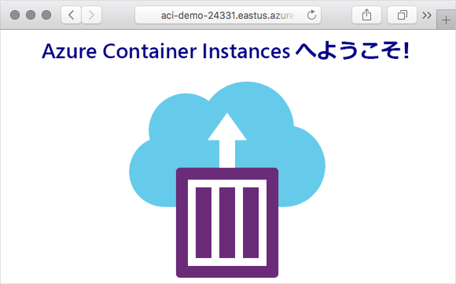

# ミニラボ: Azure Container Instances を実行する

このラボでは、Azure でコンテナーを作成し、完全修飾ドメイン名 (FQDN) を使用してインターネットに公開します。

Azure Container Instances は、簡単なアプリケーション、タスク自動化、ジョブのビルドなど、分離されたコンテナーで操作できるシナリオに適しています。利点のいくつかは次のとおりです。

* **高速起動**: コンテナーを数秒で起動します。

* **1 秒あたりの請求**: 費用が発生するのはコンテナーの実行中だけです。

* **ハイパーバイザーレベルのセキュリティ**: アプリケーションを VM にある場合と同じように完全に分離します。

* **カスタム サイズ**: CPU コアとメモリの値を正確に指定します。

* **永続的ストレージ**: 取得するコンテナーに Azure ファイルの共有を直接マウントし、状態を取得および永続化します。

* **Linux および Windows**: 同じ API で Windows と Linux コンテナーの両方をスケジュールできます。

複数のコンテナー間でのサービスの検出、自動スケーリング、アプリケーションの調整されたアップグレードなど、コンテナーの完全なオーケストレーションが必要な場合については、Azure Kubernetes Service (AKS) をお勧めします。

## コンテナーを作成する

1. Azure サブスクリプションを使用して、[https://portal.azure.com ](https://portal.azure.com/)で Azure portal にサインインします。

2. Cloud Shell アイコンを使用して、Azure portal 内から Azure Cloud Shell を開きます。


3. モジュールの作成が終了したら簡単にクリーンアップできるように、**learn-deploy-aci-rg**  という名前の新しいリソース グループを作成します。別のリソース グループ名を選択する場合は、このモジュールの残りの演習で覚えておいてください。また、例えば**米国東部**のような、リソース グループを作成するリージョンを選択する必要もあります。

```Azure CLI
az group create --name learn-deploy-aci-rg --location eastus
```

```az container create``` コマンドに名前、Docker イメージ、および Azure リソース グループを指定してコンテナーを作成します。DNS 名ラベルを指定して、インターネットにコンテナーをオプションで公開できます。この例では、小さな Web アプリをホストするコンテナーをデプロイします。画像を配置する場所を選択することもできます。 **米国東部**地域を使うことにしますが、自分の近くの場所に変更できます。

4. コンテナーをインターネットに公開する DNS 名を提供します。DNS 名は一意である必要があります。学習を目的として、一意の名前を保持する Bash 変数を作成するために、 Cloud Shell からこのコマンドを実行します。

```Azure CLI
DNS_NAME_LABEL=aci-demo-$RANDOM
```

5. 次の```az container create```コマンドを実行して、コンテナー インスタンスを開始します。

```Azure
az container create \
  --resource-group learn-deploy-aci-rg \
  --name mycontainer \
  --image microsoft/aci-helloworld \
  --ports 80 \
  --dns-name-label $DNS_NAME_LABEL \
  --location eastus
```

```$DNS_NAME_LABEL```で DNS 名を指定します。イメージ名 **microsoft/aci-helloworld** は、基本的な Node.js Web アプリケーションを実行する Docker Hub でホストされている Docker イメージを参照します。

6. ```az container create```コマンドが完了したら、```az container show```を実行してステータスを確認します。

```Azure CLI
az container show \
  --resource-group learn-deploy-aci-rg \
  --name mycontainer \
  --query "{FQDN:ipAddress.fqdn,ProvisioningState:provisioningState}" \
  --out table
```

コンテナーの完全修飾ドメイン名 (FQDN) とそのプロビジョニングの状態を確認します。次に例を示します。

```output
FQDN ProvisioningState

-------------------------------------- -------------------

aci-demo.eastus.azurecontainer.io Succeeded
```

コンテナーの状態が **作成中** の場合は、しばらく待ってから、**成功** 状態になるまでコマンドを再実行してください。

7. ブラウザーからコンテナーの FQDN に移動して、コンテナーが実行されていることを確認します。


