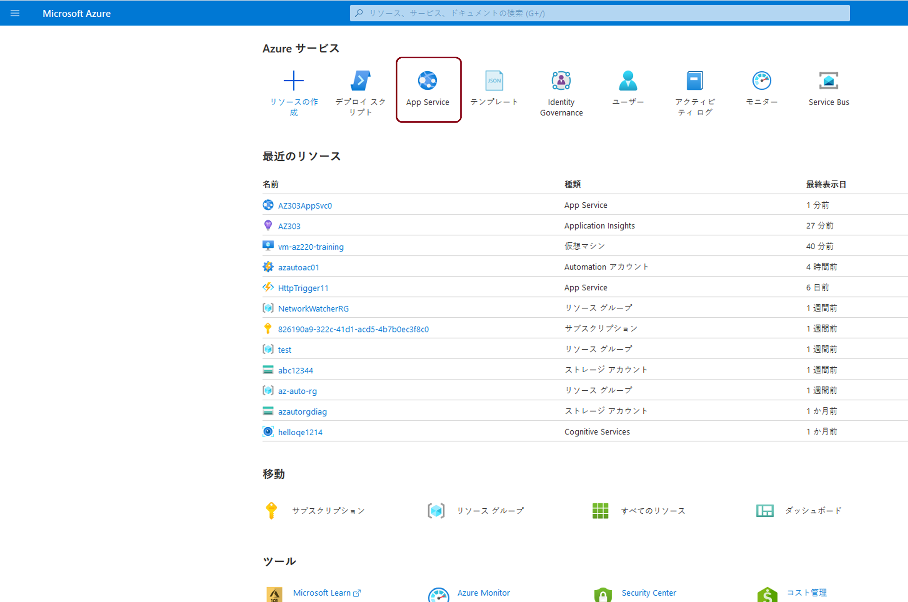
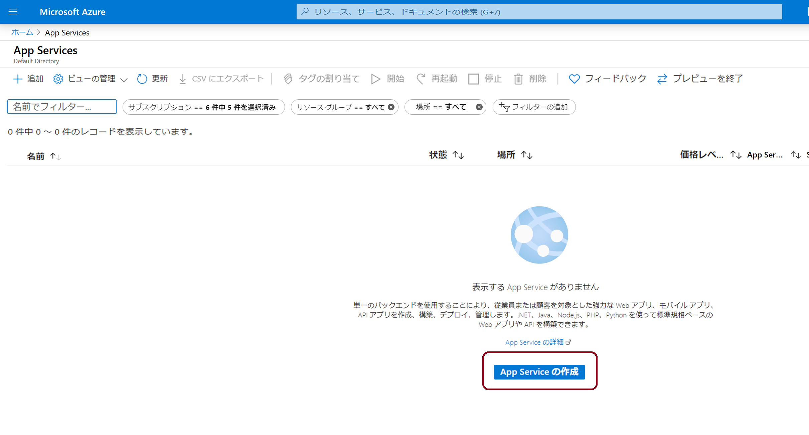
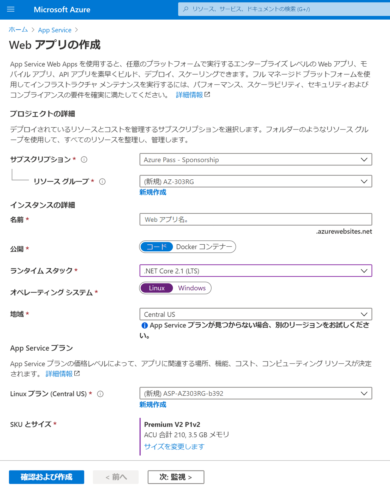
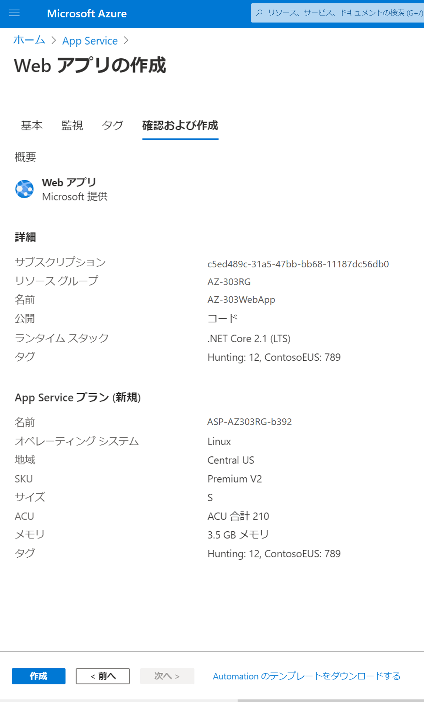
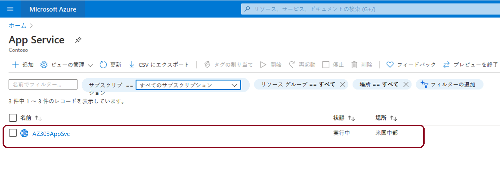
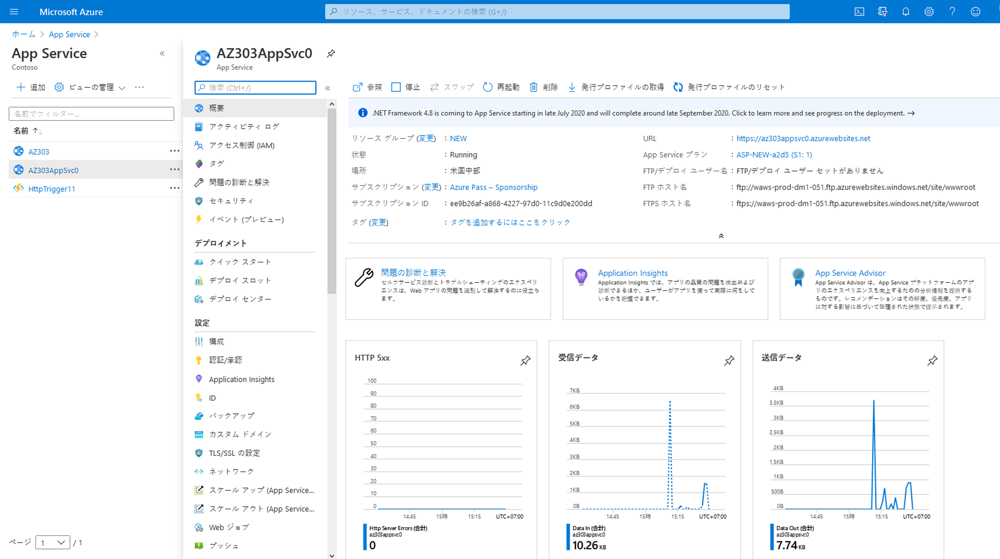
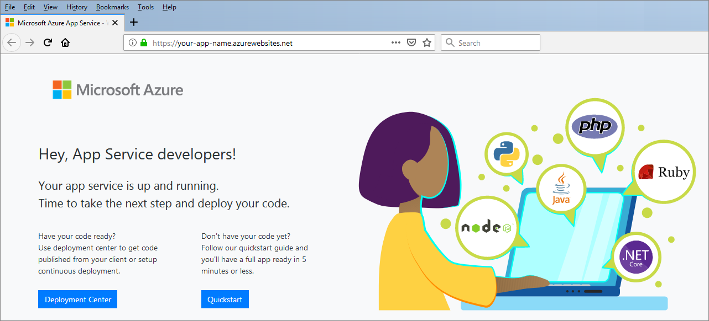

# ミニラボ: App Service および Web アプリ の作成

このデモでは、Azure portal を使用して、Web アプリと Azure App Service を作成します。

## App Service および Web アプリの作成

1. Azure portal [(https://portal.azure.com)](https://portal.azure.com/) にサインインします。

1. Azure portal メニューまたは**ホーム** ページで 、 「**アプリ サービス**」 を選択します。    

    

2. **「App Services」 ページ** で、 **「App Service の作成」** を選択 します。 

    

3. **「Web アプリ」** から、次の値を完成します。

| フィールド | 値 | 詳細 |
|------------------|-----------------------------------------------|-------------------------------------------------------------------------------------------------------------------------------------------------------------------------------------------------------------------------------------------------------------------------------------------------------------------------|
| サブスクリプション | サブスクリプションを選択します | 作成する Web アプリは、リソース グループに属している必要があります。ここでは、リソース グループが属する (または、ウィザード内で作成する場合は、その Azure サブスクリプション) を選択します。 |
| リソース グループ | メニューから選択する | Web アプリが属するリソース グループ。すべての Azure リソースは、リソース グループに属している必要があります。 |
| 名前 | 一意の名前を入力する | Web アプリの名前。この名前は、アプリの URL appname.azurewebsites.net. の一部になります。選択する名前は、Azure Web Apps 全体で一意である必要があります。 |
| 公開 | Code | アプリケーションの発行に使用する方法。アプリケーションをコードとして公開する場合は、アプリを実行するための App Service リソースを準備するようにランタイム スタックを構成する必要もあります。 |
| ランタイム スタック | .NET Core 3.1 (LTS) | アプリケーションが実行されるプラットフォーム。ここでの選択は、オペレーティング システムの選択肢があるかどうかに影響を与える可能性があります。一部のランタイム スタックでは、App Service は 1 つのオペレーティング システムのみをサポートしています。 |
| オペレーティング システム | Linux | アプリを実行する仮想サーバーで使用されるオペレーティング システム。 |
| リージョン | 米国中部 | アプリのホスト元となる地理的な地域。 |
| Linux プラン | デフォルトのままにする | アプリを強化する App Service プランの名前。デフォルトで、ウィザードは Web アプリと同じリージョンに新しいプランを作成します。 |
| SKU とサイズ | デフォルト | 作成する計画の価格レベル。これにより、アプリの電源を供給する仮想サーバーのパフォーマンス特性と、アプリがアクセスできる機能が決まります。F1 階層を選択するには 、「サイズの変更」 を選択して Spec Picker ウィザードを開きます。「開発/テスト」 タブで、リストから F1 を選択し、「適用」 を選択します。 |

4. **「レビューと作成」** を選択してレビュー ページに移動し、 **「作成」** を選択して Web アプリを作成します。

    

> **注**: Web アプリを作成して使用できる状態にするまでに数秒かかる場合があります。

ポータルがデプロイ ページに表示され、デプロイのステータスが表示されます。 

## Web アプリをプレビューする

アプリの準備ができたら、Azure portal で新しいアプリに移動します。

1. Azure ポータル メニューまたは **「ホーム ページ」**で、 **「すべてのリソース」** を選択します。

2. 一覧から Web アプリの App Service を選択します。App Service プランではなく、App Service を選択してください。

    

    ポータルに **「App Service」** 概要ページが表示されます。

    

1. 新しい Web アプリの既定のコンテンツをプレビューするには、右上の URL を選択します。読み込まれるプレースホルダー ページは、Web アプリが起動して実行されており、アプリのコードのデプロイを受け取る準備ができていることを示します。

    

 
