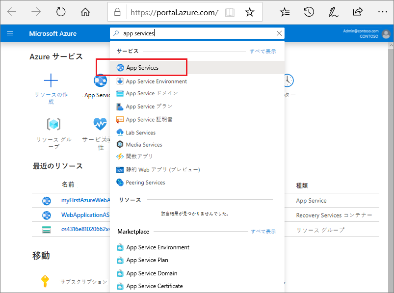
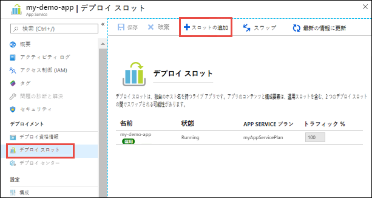
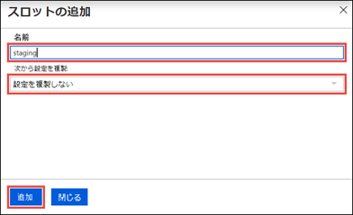
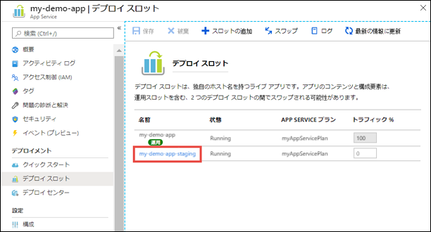
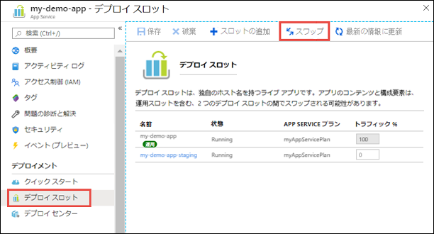
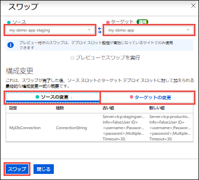

# ミニラボ: ステージング スロットのデプロイ

アプリケーションを非運用スロットに展開すると、次の利点があります。

* 運用スロットでスワップする前に、ステージング デプロイ スロットでアプリの変更を確認できます。
* 最初にアプリをスロットにデプロイし、実稼働にスワップすると、実稼働にスワップされる前に、スロットのすべてのインスタンスがウォームアップされます。アプリをデプロイする際、これによりダウンタイムが解消されます。トラフィックのリダイレクションはシームレスであり、スワップ操作のためにドロップされる要求がありません。事前スワップ検証が不要な場合、「自動スワップ」(#Auto-Swap)を構成することにより、このワークフロー全体を自動化できます。
* スワップ後、以前ステージングされたアプリを搭載するスロットには、前の運用アプリがあります。運用スロットにスワップされた変更が期待どおりでない場合は、同じスワップを直ちに実行して "最後の正常なサイト" を取り戻すことができます。

## スロットの追加
複数のデプロイ スロットを有効にするには、アプリが **Standard**、**Premium** または **Isolated** レベルで実行されている必要があります。

1. Azure portal [(https://portal.azure.com)](https://portal.azure.com/) にサインインします。 ** App Services **を検索して選択し、アプリを選択します。 
   
    
   
2. 左側のウィンドウで、**「デプロイ スロット」** > **「スロットの追加」** を選択します。
   
    
   
   > **注:** アプリが **Standard** または **Premium** もしくは **Isolated** レベルになっていない場合は、段階的な発行を有効にするためにサポートされているレベルを示すメッセージを受信します。このポイントで、**アップグレード**を選択し、続行する前にアプリの**スケール**タブに移動するオプションがあります。

3. 「**スロットの追加**」 ダイアログ ボックスで、スロットに名前を付け、別のデプロイ スロットからアプリ構成のクローンを作成するかどうかを選択します。「**追加**」 を選択して続行します。
   
    
   
    既存のスロットから構成のクローンを作成できます。クローン作成の設定には、アプリの設定、接続文字列、言語フレームワーク バージョン、Web ソケット、HTTP バージョン、プラットフォームのビット数などがあります。

4. スロットを追加したら、「**閉じる**」を選してダイアログ ボックスを閉じます。これで、新しいスロットが 「**デプロイ スロット**」 ページに表示されます。既定では、新しいスロットの **Traffic ％** は 0 に設定され、すべての顧客のトラフィックは運用スロットにルーティングされます。

5. 新しいデプロイ スロットを選択して、そのスロットのリソース ページを開きます。
   
    

    ステージング スロットには、他の App Service アプリと同様に管理ページがあります。スロットの構成を変更することもできます。デプロイ スロットを表示していることをリマインドするため、アプリ名は **\<app-name>/\<slot-name>** と表示され、アプリの種類は **App Service (スロット)** になります。同じ指定でリソース グループ内の個別のアプリとして表示されるスロットに注意してください。

新しいデプロイ スロットには、別のスロットから設定を複製してもコンテンツがありません。たとえば、Git を使用してこのスロットに公開できます。別のリポジトリ ブランチまたはまったく異なるリポジトリから、スロットにデプロイできます。

## ２つのスロットのスワップ 
アプリの **デプロイ スロット** ページと**概要**ページで、デプロイ スロットをスワップすることができます。

> **重要:** アプリをデプロイ スロットから運用にスワップする前に、運用がターゲット スロットであり、ソース スロットのすべての設定が、運用で考えている通りに構成されていることを確認してください。

デプロイ スロットをスワップする方法

1. アプリの「**デプロイ スロット**」ページに移動し、「**スワップ**」を選択します。
   
    

    「**スワップ**」ダイアログ ボックスには、選択した変更予定のソース スロットとターゲット スロットの設定が表示されます。

2. 必要な「**ソース**」スロットと「**ターゲット**」スロットを選択します。通常、ターゲットは運用スロットです。また、「**ソースの変更」**」タブと「**ターゲットの変更**」タブを選択し、構成の変更が予想されていることを確認します。完了後、「**スワップ**」を選択すると、スロットをすぐにスワップできます。

    

3. 完了したら、「**閉じる**」を選択してダイアログ ボックスを閉じます。
