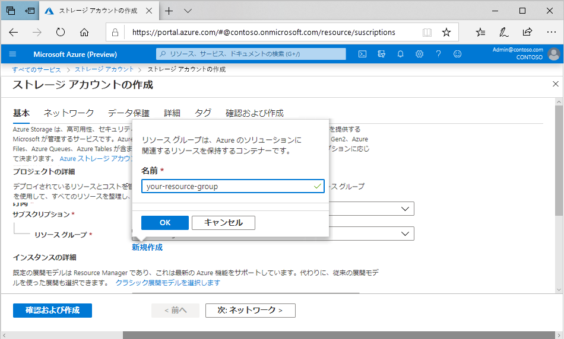

# ミニラボ: ポータルでストレージ アカウントを作成する

すべてのストレージ アカウントは、Azure リソース グループに属している必要があります。リソース グループは、Azure サービスをグループ化するための論理コンテナーです。ストレージ アカウントを作成するときに、新しいリソース グループを作成するか、既存のリソース グループを使用するかのいずれかを選ぶことができます。この記事には、新しいリソース グループを作成する方法を示します。

汎用 v2ストレージ アカウントは、BLOB、ファイル、キュー、テーブル、ディスクなど、すべての Azure Storage サービスにアクセスできます。ここで説明する手順では、クイック スタートには汎用 v2 ストレージ アカウントが作成されますが、任意の種類のストレージ アカウントを作成する手順は似ています。

Azure portal に汎用 v2 ストレージ アカウントを作成するには、次の手順に従います。

1. Azure portal メニューで、 **「すべてのサービス」** を選択します。リソースの一覧に、 **ストレージ アカウント**を入力します。入力し始めると、入力に基づいてリストがフィルター処理されます。 **「ストレージ アカウント」** を選択します。

1. 表示される **ストレージ アカウント** ウィンドウに、 **追加**を選択 します。

1. ストレージ アカウントを作成するサブスクリプションを選択します。

1. **リソース グループ** フィールドに、 **新規作成**を選択します。次の図に示すように、新しいリソース グループの名前を入力します。

    

1. 次に、ストレージ アカウントの名前を入力します。選択する名前は、Azure 全体に独特である必要があります。また、名前の長さは 3 から 24 文字とし、数字と小文字のみを使用できます。

1. ストレージ アカウントの場所を選択するか、或いは既定の場所を使用します。

1. これらのフィールドは既定値に設定したままにします。

    | フィールド| 値|
    | :--- | :--- |
    | 展開モデル| Resource Manager|
    | パフォーマンス| Standard|
    | アカウントの種類| ストレージ V2(汎用 v2)|
    | レプリケーション| 読み取りアクセス geo 冗長ストレージ (RA - GRS)|
    | アクセス階層| ホット|

1. **確認および作成** を選択して、ストレージ アカウントの設定を確認し、アカウントを作成します。

1. **作成** を選択します。

>:heavy_check_mark: **注記:** このモジュールの後のデモで作成したストレージ アカウントは、他のデモ/チュートリアルで使用します。
