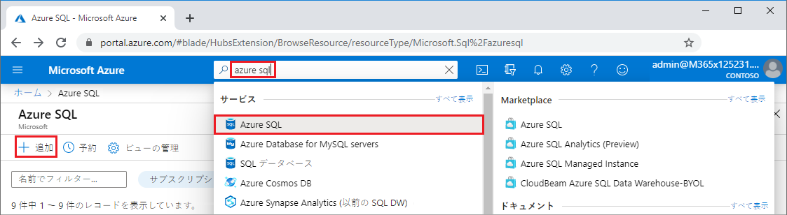
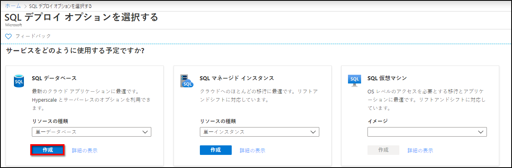
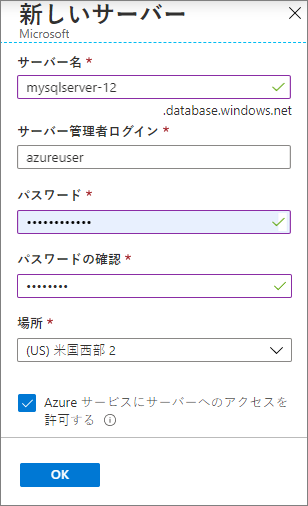
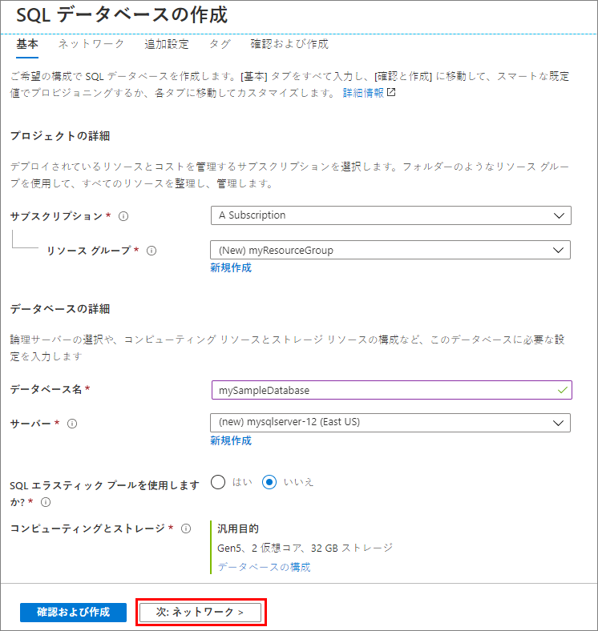
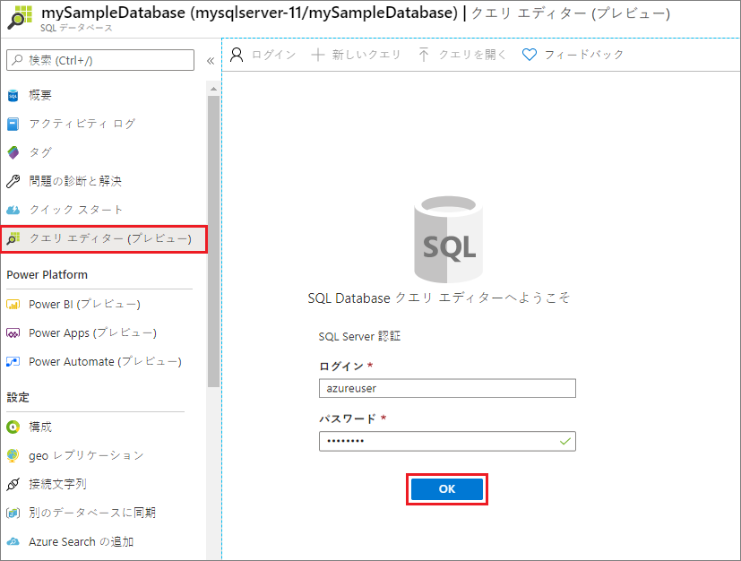
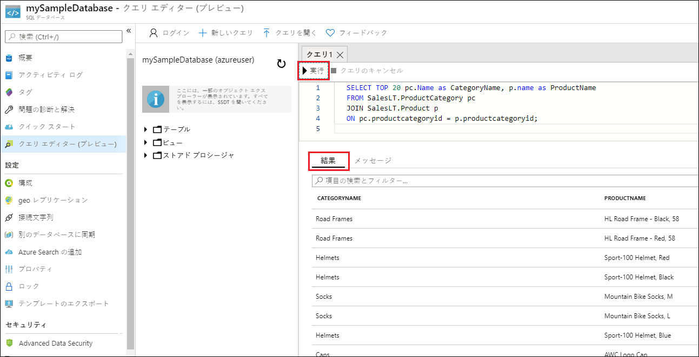

# ミニラボ: Azure SQL データベースの単一データベースを作成する

このミニラボでは、Azure portal を使用して、Azure SQL データベースの単一データベースを作成します。次に、Azure portal のクエリ エディターを使用して、データベースにクエリを実行します。

単一データベースは、Azure SQL データベースの最も迅速かつ簡単なデプロイ オプションです。指定した Azure リージョンの Azure リソース グループ内にある SQL データベース サーバー内の単一のデータベースを管理できます。このミニラボでは、新しいデータベース用の新しいリソース グループと SQL サーバーを作成します。

*プロビジョニングされた*コンピューティング層または*サーバーレス* コンピューティング層に単一のデータベースを作成できます。プロビジョニングされたデータベースでは、CPU やメモリを含む一定量のコンピューティング リソースが事前に割り当てられ、2 つの購入モデルのいずれかが使用されます。このミニラボでは、仮想コア ベースの購入モデルを使用してプロビジョニングされたデータベースを作成します。

## 単一データベースを作成する

この手順では、Azure SQL Database サーバーと、AdventureWorksLT サンプル データを使用する単一のデータベースを作成します。Azure portal のメニューと画面を使用するか、Azure Cloud Shell で Azure CLI スクリプトまたは PowerShell スクリプトを使用して、データベースを作成することができます。

Azure portal でリソース グループ、SQL Server、および単一データベースを作成するには、次の手順を実行します。

1. Azure portal [(https://portal.azure.com)](https://portal.azure.com/) にサインインします。

2. 検索バーで、 「**Azure SQL**」 を検索して選択します。

3. Azure SQL ページで、 「**追加**」 を選択します。



4. 「**SQL デプロイ オプションの選択**」 ページで、 「**リソース**」 の種類の下にある 「**Single Database**」 と一緒に 「**SQL データベース**」 タイルを選択します。 「**詳細を表示**」 を選択すると、さまざまなデータベースに関する詳細情報を表示できます。 

5. 「**作成**」 を選択します。



6. 「SQL  データベースの作成」 フォームの 「**基本**」 タブで、 「**プロジェクトの詳細**」 で、適切な Azure サブスクリプションが選択されていない場合は選択します。   

7. 「**リソース グループ**」 で 「**新規作成**」 を選択し、 *myResourceGroup* と入力して、 「**OK**」 を選択します。

8. 「**データベースの詳細**」 で、 「**データベース名**」 に「mySampleDatabase」と入力します。   

9. 「**サーバー**」 で、 「**新規作成**」 を選択し、次のように 「新しいサーバー」 フォームに入力します。   

- **サーバー名**: 一意性のために「*mysqlserver*」といくつかの文字を入力します。 

- **サーバー管理者のログイン**: 「*azureuser*」と入力します。

- **パスワード**: 要件を満たすパスワードを入力し、 「**パスワードの確認**」 フィールドにもう一度入力します。

- **保存先**: ドロップダウンから、 「**(米国) 米国東部**」 などの場所を選択します。

「**OK**」 を選択します。



サーバーとデータベースにログインできるように、サーバー管理者のログインとパスワードを記録してください。ログインまたはパスワードを忘れた場合は、データベース作成後に 「**SQLサーバー**」 ページでログイン名の取得や、パスワードのリセットができます。 「**SQL Server**」 ページを開くには、データベースの 「**概要**」 ページのサーバー名を選択します 。

10. 「**コンピューティング + ストレージ**」 で、既定値を再構成する場合は、 「**データベースの構成**」 を選択します。   

「**構成**」ページでは、必要に応じて次の操作を実行できます。 

- 「**コンピューティング層**」 を 「**プロビジョニング済み**」 から 「**サーバーレス**」 に変更します。     

- 「**仮想コア**」 と 「**データの最大サイズ**」 の設定を確認および変更します。

- ハードウェアの生成を変更するには、 「**構成の変更**」 を選択します。 

変更を行った後で、 「**適用**」 を選択します。 

11. 「**次へ: **」、ページの下部にある**ネットワーク**。 



12. **「ネットワーク」** タブの **「接続方法」** で、 **「パブリック エンドポイント」** を選択します。     

13. **「ファイアウォール ルール」** で、 **「現在のクライアント IP アドレスを追加する」** を **「はい」** に設定します。     

14. 「**次へ: **」、ページの下部にある**追加**設定。

![[ネットワーク] タブ](../../Linked_Image_Files/demo_sql_image5.png)


15. **「追加設定」** タブの **「データ ソース」** セクションで、 **「既存データを使用する」** に **「サンプル」** を選択します。       

16. ページの下部にある **「Review + create」** を選択します。

![[その他の設定] タブ](../../Linked_Image_Files/demo_sql_image6.png)

17. 設定を確認したら、 「**作成**」 を選択します。 

## データベースをクエリする

データベースを作成すると、Azure portal の組み込みのクエリ エディターを使用して、データベースに接続し、データをクエリできます。

1. ポータルで 「**SQL データベース**」 を検索して選択し、リストからデータベースを選択します。

2. データベースの 「**SQL Database**」 ページで、左側のメニューから 「**クエリ エディター**」 を選択します。

3. サーバー管理者のログイン情報を入力し、 「**OK**」 をクリックします。



4. クエリ エディターのウィンドウで次のクエリを入力します。

```SQL

SELECT TOP 20 pc.Name as CategoryName, p.name as ProductName

FROM SalesLT.ProductCategory pc

JOIN SalesLT.Product p

ON pc.productcategoryid = p.productcategoryid;
```

5. 「**実行**」 を選択し、 「**結果**」 ウィンドウでクエリの結果を確認します。



6. 「**クエリ エディター**」 ページを閉じ、保存していない編集を破棄するかどうかを確認するメッセージが表示されたら 「**OK**」 をクリックします。

 

 
