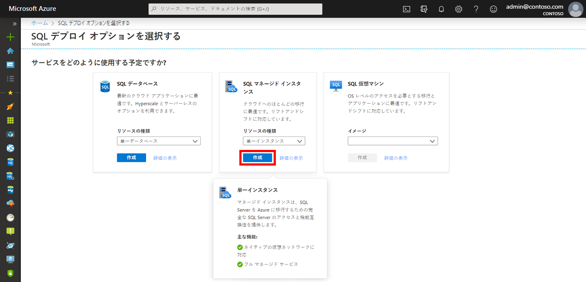
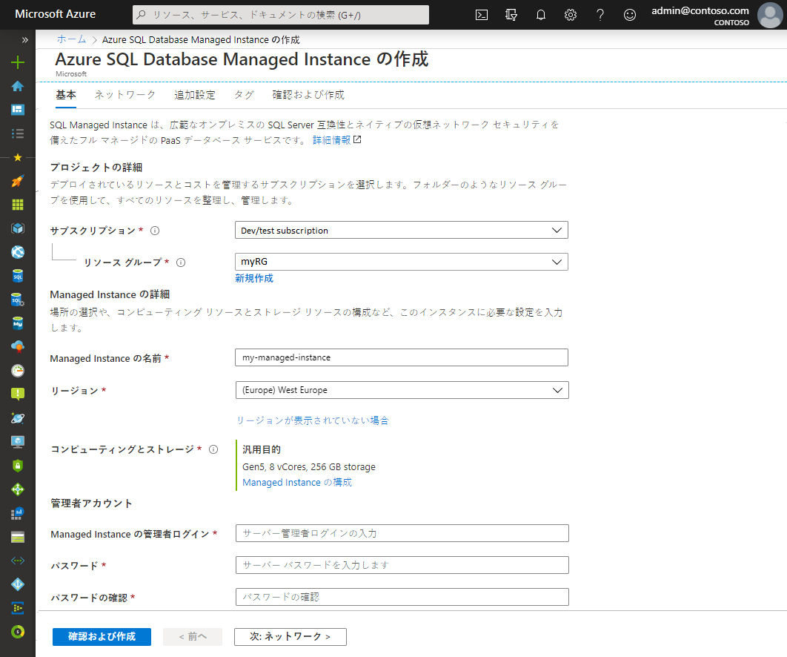
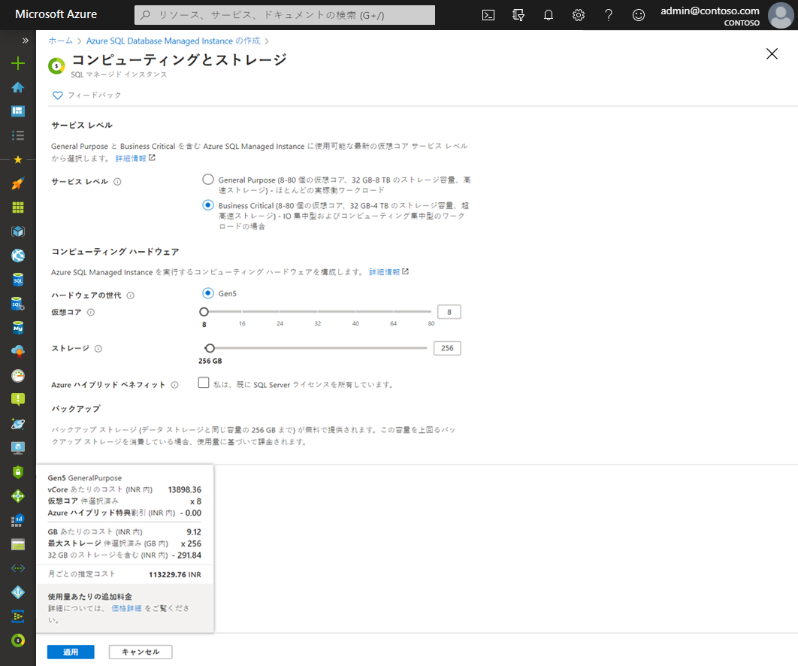
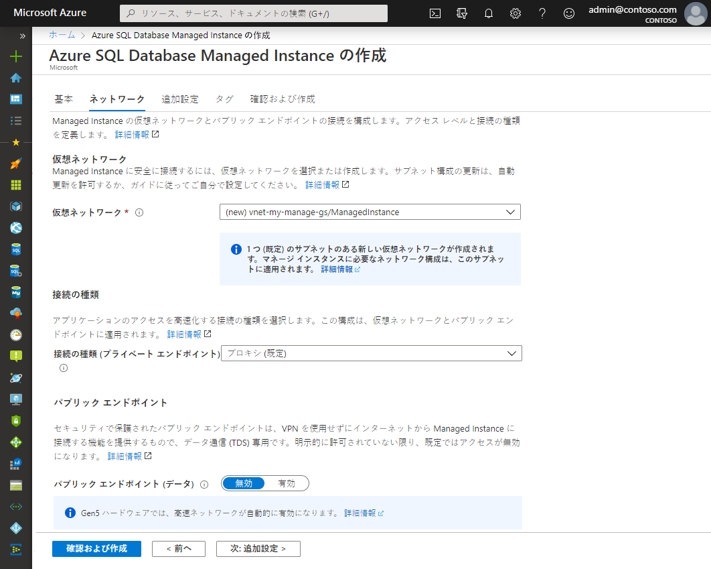
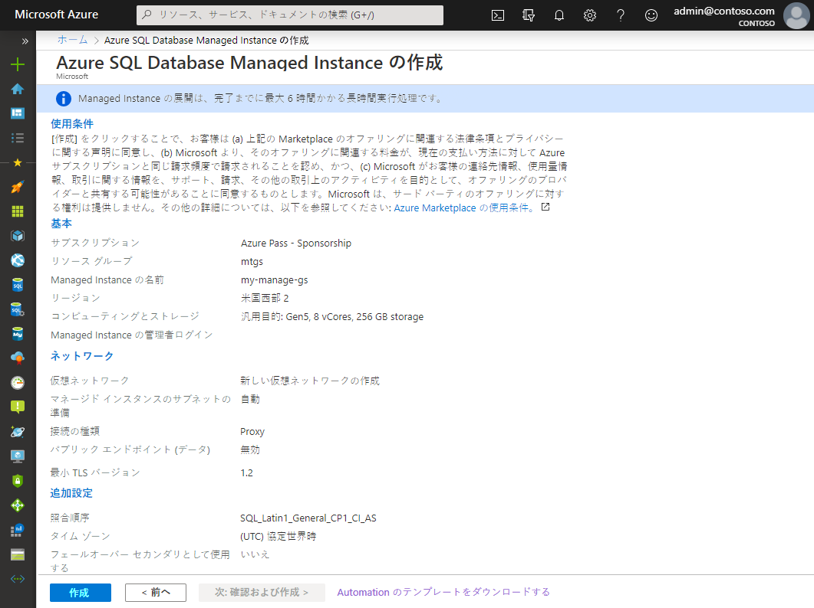

# ミニ ラボ: Azure SQL Database Managed Instance を作成する

このミニラボでは、Azure portal で Azure SQL Database Managed Instance を作成する方法について説明します。

Azure portal [(https://portal.azure.com)](https://portal.azure.com/) にサインインします。

## Managed Instance を作成する

以下の手順では、Managed Instance の作成方法を示します。

1. 「Azure portal」 の左側のメニューで  **「Azure SQL」** を選択します。 **Azure SQL** が一覧にない場合は、 **「すべてのサービス」** を選択し、検索ボックスに **「Azure SQL」と入力します。

2. **「+追加」** を選択して **「SQL デプロイメント オプションの選択**」 ページを開きます。 **「Managed Instance」** タイルで **「詳細を表示」** を選択すると、Azure SQL Database Managed Instance に関する追加情報を表示できます。

3. 「**作成**」 を選択します。

4. **「Azure SQL Database Managed Instance の作成」** プロビジョニング フォームのタブを使用して、必要な情報とオプションの情報を追加します。次のセクションでは、これらのタブについて説明します。

## 基本

* **「基本**」 タブで必要な必須情報を入力します。

このタブで必要な情報の参照として、次の表を使用してください。

| 設定 | 推奨値 | 説明  |
|---------------------------------------------------|---------------------------------------------------------------------------------|-------------------------------------------------------------------------------------------------------------------------------------------------------------------------------------------------------------------------------------------------------------------------------------------------------------------------------------------------------------------------------------------------------------------------------------------------------------------------------------------------------------------------------------------------------------------------------------------------------------------------------------------------------------------------------------------------------------|
| 仮想ネットワーク | 「新しい仮想ネットワークを作成」 または 「有効な仮想ネットワークとサブネットを作成」 のいずれかを選択します。 | ネットワークまたはサブネットが使用できない場合は、新しい管理インスタンスのターゲットとして選択する前に、ネットワーク要件を満たすように変更する必要があります。管理対象インスタンスのネットワーク環境を構成する要件については、「管理対象インスタンスの仮想ネットワークを構成する」を参照してください。 |
| 接続の種類 | プロキシとリダイレクト接続の種類を選択します。 | 接続の種類の詳細は、「Azure SQLデータベース接続ポリシー」を参照してください。 |
| パブリック エンドポイント | 編集を有効にするを選択する | Managed Instance でパブリック データエンド ポイントを介してアクセス可能な管理インスタンスを実現するには、パブリック エンドポイントを有効にする必要があります。 |
| アクセスを許可する (パブリック エンドポイントが有効な場合) | 次のいずれかのオプションを選択します。 | ポータルの操作を使用すると、パブリック エンドポイントを使用してセキュリティ グループを構成できます。   |

* **「Managed Instance を構成」** を選択して、コンピューティング リソースとストレージ リソースをサイズ変更し、価格レベルのオプションを確認します。スライダーまたはテキスト ボックスを使用して、ストレージの量と仮想コアの数を指定します。完了したら、 **「適用」**を選択して選択範囲を保存します。

* Managed Instance を作成する前に選択内容を確認するには、 **「Review + create」** を選択できます。  または、 **「次へ」** を選択してネットワーク オプションを構成します。 **ネットワーク**

## ネットワーク

* **「ネットワーク」** タブのオプション情報を入力します。この情報を省略すると、ポータルはデフォルト設定を適用します。

このタブで必要な情報の参照として、次の表を使用してください。

| 設定 | 推奨値 | 説明  |
|---------------------------------------------------|---------------------------------------------------------------------------------|------------------------------------------------------------------------------------------------------------------------------------------------------------------------------------------------------------------------------------------------------------------------------------------------------------------------------|
| 仮想ネットワーク | 「新しい仮想ネットワークを作成」 または 「有効な仮想ネットワークとサブネットを作成」 のいずれかを選択します。 | ネットワークまたはサブネットが使用できない場合は、新しい管理インスタンスのターゲットとして選択する前に、ネットワーク要件を満たすように変更する必要があります。管理対象インスタンスのネットワーク環境を構成する要件については、「管理対象インスタンスの仮想ネットワークを構成する」を参照してください。 |
| 接続の種類 | プロキシとリダイレクト接続の種類を選択します。 | 接続の種類の詳細は、「Azure SQLデータベース接続ポリシー」を参照してください。 |
| パブリック エンドポイント | 編集を有効にするを選択する | Managed Instance でパブリック データエンド ポイントを介してアクセス可能な管理インスタンスを実現するには、パブリック エンドポイントを有効にする必要があります。 |
| アクセスを許可する (パブリック エンドポイントが有効な場合) | 次のいずれかのオプションを選択します。 | ポータルの操作を使用すると、パブリック エンドポイントを使用してセキュリティ グループを構成できます。   |

* Managed Instance を作成する前に、 **「Review + create」** を選択して選択内容を確認します。または、 **「次へ」** を選択して、さらにカスタム設定を構成します。 **追加の設定**:

## その他の設定

* **「追加設定」** タブのオプション情報を入力します。この情報を省略すると、ポータルはデフォルト設定を適用します。

![Managed Instance を作成するための [追加設定] タブ](../../Linked_Image_Files/demo_managed_sql_image5.png)

このタブで必要な情報の参照として、次の表を使用してください。

| 設定 | 推奨値 | 説明  |
|-----------------------------------------------------------------------|------------------------------------------------------------------------------------------------------------------------------------------------------------------------------------------------------------|-----------------------------------------------------------------------------------------------------------------------------------------------------------------------|
| 照合順序 | Managed Instance に使用する照合順序を選択します。SQL サーバーからデータベースを移行する場合は、SELECT SERVERPROPERTY(N'照合順序')を使用してソース照合順序を確認し、その値を使用します。 | 照合順序の詳細は、「サーバー照合順序を設定または変更」を参照してください。 |
| Time zone | Managed Instance が監視するタイム ゾーンを選択します。 | 詳しくは、「タイムゾーン」を参照してください。 |
| フェールオーバー セカンダリとして使用 | 「はい」を選択します。 | このオプションを有効にすると、Managed Instance がフェールオーバー グループのセカンダリとして使用されます。 |
| プライマリ Managed Instance (フェールオーバー セカンダリとして使用する場合は 「はい」)。 | 作成する Managed Instance と同じ DNS ゾーンに参加する既存のプライマリ Managed Instance を選択します。 | この手順では、フェールオーバー グループの作成後の構成を有効にします。  |

## Review + create

5. Managed Instance を作成する前に、選択内容を確認するには、 **「Review + create」** タブを選択します。

6. **「作成」** を選択して、Managed Instance をプロビジョニングします。

 
