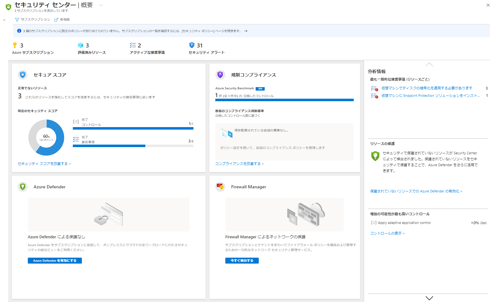

# ミニラボ: Azure Security Center

Azure Security Center は、ハイブリッド クラウド ワークロード全体で統合されたセキュリティ管理と脅威に対する保護を実現します。Azure サブスクリプションで Security Center を有効にするには、次の手順を実行します。

1. [Azure portal](https://portal.azure.com) にサインインします。

1. ポータルのメニューから **「Security Center」** を選択します。 

    Security Center の概要ページが開きます。

    

**「セキュリティ センター - 概要 」** では、ハイブリッド クラウド ワークロードのセキュリティ対策の統合ビューが表示されるので、ワークロードのセキュリティを検出して評価したり、リスクを特定して軽減したりできます。ご自身や他のサブスクリプション ユーザーによってまだオンボードされていない Azure サブスクリプションは、自動的に無料で有効になります。

Security Center を初めて起動してから数分以内に、以下の項目が表示されます。

- 接続されているリソースのセキュリティを向上させる方法についての洞察推奨事項。
- 問題の迅速な調査と攻撃の修正に必要な情報と、優先度の高いセキュリティアラート。
- Security Center によって現在評価されているリソースとそれぞれのセキュリティの状態のインベントリ。
- Security Score は、サブスクリプションのセキュリティ体制の測定値です。

> **ヒント:** 管理グループ内のすべてのサブスクリプションで Security Center を有効にするには、[複数の Azure サブスクリプションの Security Center を有効にする方法](https://docs.microsoft.com/ja-jp/azure/security-center/onboard-management-group)に関するページを参照してください。
