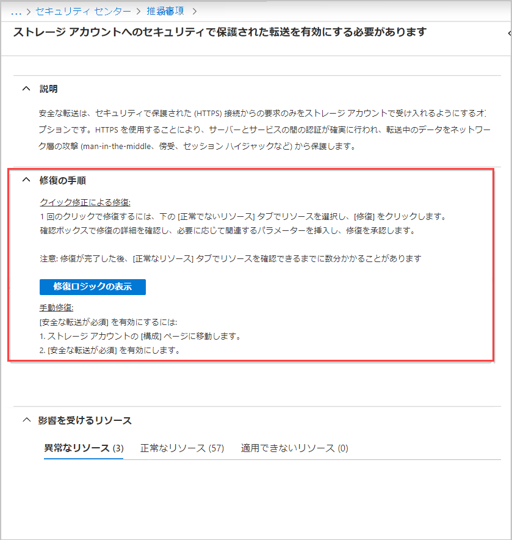
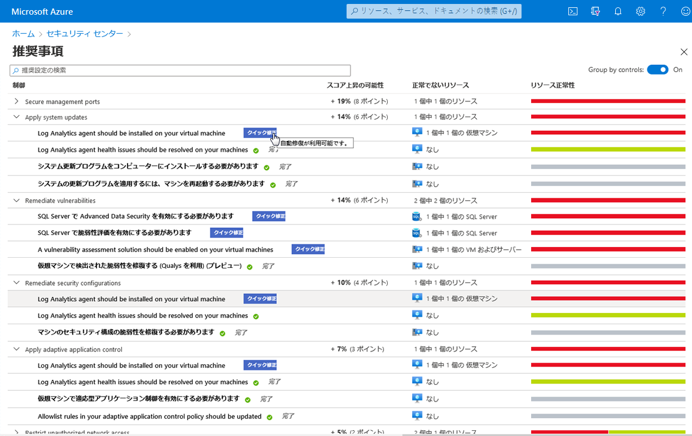

# ミニラボ: Azure Security Center

このミニラボでは、監視エージェントがアクティブ化されて **いなくても**、1 つ以上の Linux VM が必要になります。

## Azure Security Center へ移動する

1. Azure portal [(https://portal.azure.com)](https://portal.azure.com/) にサインインします。

1. **「Security Center** > **推奨事項」** に移動します。

## 推奨を使用して監視ソフトウェアを追加する

推奨事項は、リソースのセキュリティを強化する方法についての提案を提供します。推奨事項は、推奨事項で提供されている修復手順に従って実装されます。

1. リコミュネーションをクリックして修復手順セクションを開き、手順を確認します。各推奨事項には、独自の手順セットがあります。次のスクリーンショットは、HTTPS 経由のトラフィックのみを許可するようにアプリケーションを構成するための修復手順を示しています。

    

1. 推奨事項リストに戻ります。一部の推奨事項には、 **クイック修正**ラベルがあることに留意してください。クイック修正を使用すると、複数のリソースに関する推奨事項を迅速に修復できます。特定の推奨事項でのみ使用できます。クイック修正は修復を簡素化し、セキュア スコアを迅速に向上させ、環境のセキュリティを向上させます。

1. **「セキュリティ構成の修復」** ボックスの一覧で、 **「仮想マシンに監視エージェントをインストールする」 の推奨事項の横にある **「クイック修正」** をクリックします**

    

1. **「異常なリソース」** タブで、推奨事項を実装するリソースを選択し、 **「修復」** をクリックします。

    >:heavy_check_mark: **注記:** 一覧表示されているリソースの一部は、変更するための適切なアクセス許可がないため無効になっている可能性があります。

1. 確認ボックスで、修復の詳細と影響を確認します。

    >:heavy_check_mark: **注記:** **「修復」** をクリックすると表示される **「リソースの修復」** ウィンドウの灰色のボックスに、影響が表示されます。クイック修正で修復を続行する際に何が起こるかをリストします。

1. 必要に応じて関連するパラメーターを挿入し、修復を承認します。

    >:heavy_check_mark: **注記:** 修復が完了してから、 **「正常なリソース」** タブにリソースが表示されるまでに数分かかることがあります。修復アクションを表示するには、アクティビティ ログを確認します。

1. 完了すると、修復が成功した場合に通知が表示されます。
