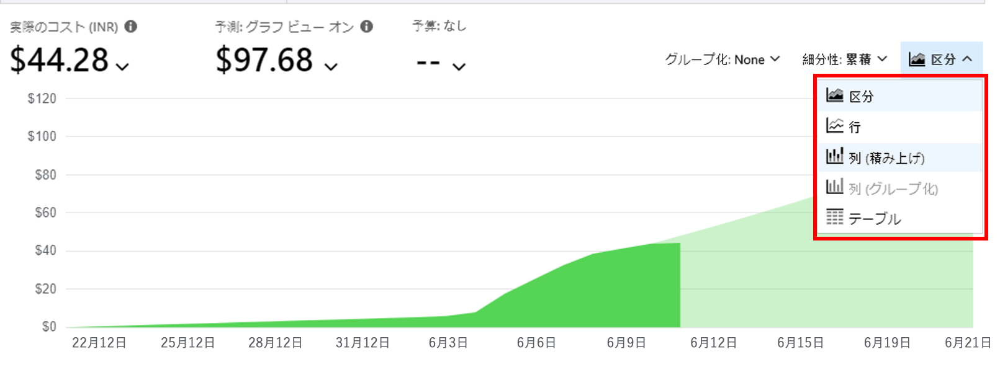
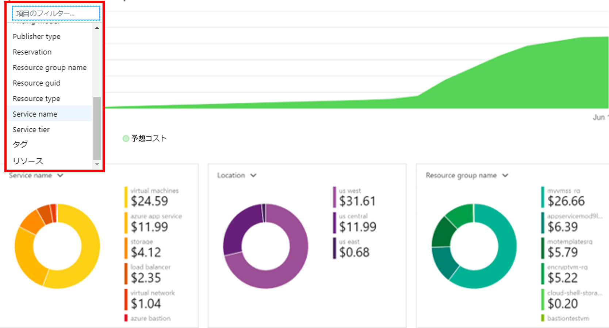

# ミニラボ: Azure Monitor でコストを監視する

このミニラボでは、請求期間中、以前に実行されているサービスと現在実行中のサービスが必要です。リソースのデプロイから 24 時間未満の場合、データを利用できない可能性があります。

## コスト分析に移動

1. Azure portal [https://portal.azure.com](https://portal.azure.com/) にサインインします。

1. **Cost Management** を検索し、結果の一覧から **「Cost Management + Billing」** を選択します。

1. **「Cost Management」** で、 **「コスト分析」** を選択して確認します。 
> これは **Cost Management + 請求の概要** と似ていることに留意してください。

## カスタム レポート

1. 実際原価と予測原価を表示するように表示をカスタマイズします。細分度を変更し、 **「範囲」** を選択してグラフの種類を変更します。

    
    
1. 追加のグラフ (**「サービス名」**、 **「場所」** および **「リソース グループ名」** など) では、これらのグラフにフィルタを使用して、さまざまなデータの結果を表示します。

    
