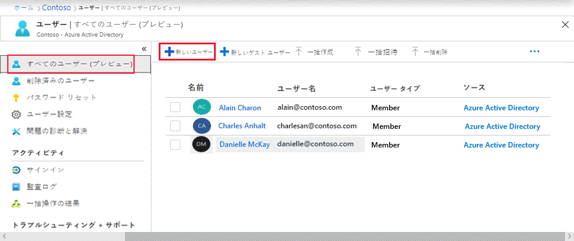

# ミニラボ: Azure Active Directory を使用してユーザーを追加する

Azure Active Directory (Azure AD) 組織から新しいユーザーを追加するか、既存のユーザーを削除します。ユーザーを追加または削除するには、ユーザー管理者またはグローバル管理者である必要があります。

Azure Active Directory ポータルを使用して新しいユーザーを作成できます。次の手順に従います。

1.	[https://portal.azure.com](https://portal.azure.com/) の Azure portal に組織のユーザー管理者としてサインインします。

2.	任意のページから *Azure Active Directory* を検索して選択します。

3.	「**ユーザー**」 を選択してから、 「**新しいユーザー**」 を選択します。

    

4.	「**ユーザー**」 ページで、このユーザーの情報を入力します。 

    - **名前**。必須。新しいユーザーの姓名。たとえば、 *TesterAAD*。

    - **ユーザー名**。必須。新しいユーザーのユーザー名。たとえば、 *TesterAAD@contoso.com* などです。ユーザー名のドメイン部分は、初期のデフォルト ドメイン名 *<yourdomainname>.onmicrosoft.com* または *contoso.com* などのカスタム ドメイン名を使用する必要があります。

    - **ジョブ情報**: ユーザーに関する詳細情報をここに追加するか、後で追加できます。ユーザー情報の追加の詳細については、「[ユーザー プロファイル情報を追加または変更する方法](https://docs.microsoft.com/ja-jp/azure/active-directory/fundamentals/active-directory-users-profile-azure-portal)」を参照してください。

5.	**パスワード** ボックスで提供される自動生成されたパスワードをコピーします。初回のサインインには、このパスワードをユーザーに提供する必要があります。

6.	「**作成**」 を選択します。

ユーザーが作成され、Azure AD 組織に追加されます。
