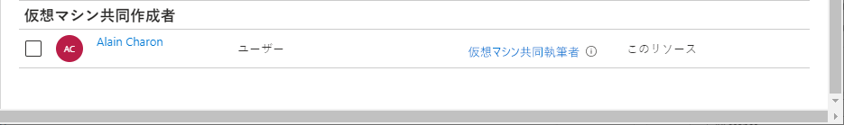

# ミニラボ: Azure ロールの割り当てを追加する 

## 前提条件

ロールの割り当てを追加または削除するには、以下の項目が必要です。

* *ユーザー アクセス管理者* や *所有者* などの ```Microsoft.Authorization/roleAssignments/write``` および ```Microsoft.Authorization/roleAssignments/delete``` 権限。


**アクセス制御 (IAM)** は、Azure リソースへのアクセスを許可するロールを割り当てるために使用するブレードです。ID およびアクセス管理とも呼ばれ、Azure portal のいくつかの場所に表示されます。サブスクリプションの 「アクセス制御 (IAM)」ブレードの例を次に示します。


「アクセス制御 (IAM)」 ブレードを最大限に活用するために、ロールを割り当て用とする際の次の 3 つの質問に答える場合に役立ちます。

**1. アクセスが必要な人物**

ユーザー、グループ、サービス プリンシパル、またはマネージド ID を指します。これは、 *セキュリティ プリンシパル* とも呼ばれます。

**2. 必要なロールとは**

権限はロールにグループ化します。複数の 「組み込みのロール」 のリストから選択するか、独自のカスタム ロールを使用できます。

**3. アクセスが必要とされる場所とは**

アクセスが適用されるリソースのセットを指します。管理グループ、サブスクリプション、リソース グループ、またはストレージ アカウントなどの単一のリソースの可能性があります。これは *スコープ* と呼ばれます。 

## ロールの割り当てを追加する

Azure RBAC で、Azure リソースへのアクセスを許可するには、ロールの割り当てを追加します。次の手順に従って、ロールを割り当てます。

1. Azure portal で、 「**すべてのサービス**」 をクリックし、アクセスを許可するスコープを選択します。 

2. そのスコープの特定のリソースをクリックします。

3. **アクセス制御 (IAM)**をクリックします。

4. 「**ロールの割り当て**」 タブをクリックして、このスコープでのロールの割り当てを表示します。 


5. 「**追加**」 > 「**ロールの割り当て**」 をクリックします。

ロールを割り当てる権限がない場合、 「**ロールの割り当ての追加**」 オプションは無効になります。


「**ロールの割り当ての追加**」 ウィンドウが開きます。 


6. 「**ロール**」ドロップダウン リストで、 「**仮想マシンの共同作成者**」 を選択します。

7. 「**選択**」リストで、ユーザー、グループ、サービス プリンシパル、またはマネージド ID を選択します。一覧にセキュリティ プリンシパルが表示されない場合は、 「**選択**」 ボックスに入力して、表示名、電子メール アドレス、およびオブジェクト識別子をディレクトリで検索できます。 

8. 「**保存**」 をクリックしてロールを割り当てます。

しばらくすると、選択したスコープでセキュリティ プリンシパルにロールが割り当てられます。



 
