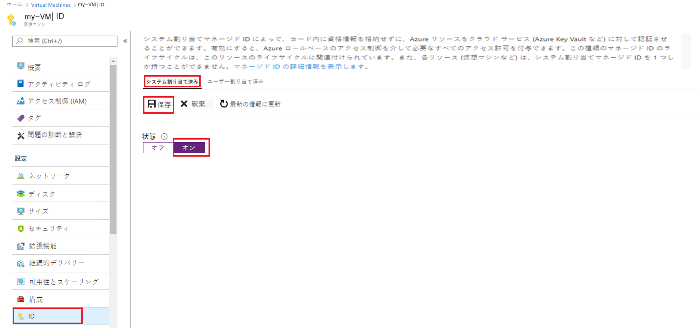

# ミニラボ: 既存の VM でシステム割り当てのマネージド ID を有効にする

## マネージド ID を有効にする

もともとプロビジョニングされていない VM でシステム割り当てのマネージド ID を有効にするには、アカウントに[仮想マシンの共同作成者](https://docs.microsoft.com/ja-jp/azure/role-based-access-control/built-in-roles#virtual-machine-contributor)の役割の割り当てが必要です。追加の Azure AD ディレクトリ ロールの割り当ては必要ありません。

1. VM を含む Azure サブスクリプションに関連付けられているアカウントを使用して、[https://portal.azure.com](https://portal.azure.com/) で Azure portal にサインインします。

2. 目的の仮想マシンに移動して、 「**ID**」 を選択します。

3. 「**システム割り当て**」、 「**状態**」 で、 「**オン**」 を選択し、 「**保存**」 をクリックします。

     

## マネージド ID を使用して Azure VM にサインインする (PowerShell)

従来、独自の ID で保護されたリソースにアクセスするには、スクリプト クライアントで次の処理を行う必要がありました。

- 機密情報/Web クライアント アプリケーションとして Azure AD に登録し、同意します。

- アプリの資格情報 (スクリプトに埋め込まれている可能性があります) を使用して、サービス プリンシパルでサインインします。

Azure リソースのマネージド ID を使用すると、Azure リソース サービス プリンシパルのマネージド ID でサインインできるため、スクリプト クライアントがサインインを行う必要がなくなります。

次のスクリプトでは、以下の方法について説明します。

1. Azure リソース サービス プリンシパルの VM のマネージド ID で Azure AD にサインインします。  

2. Azure Resource Manager コマンドレットを呼び出して、VM に関する情報を取得します。PowerShell で自動的にトークンの使用を管理します。  

   ```azurepowershell
   Add-AzAccount -identity

   # Call Azure Resource Manager to get the service principal ID for the VM's managed identity for Azure resources. 
   $vmInfoPs = Get-AzVM -ResourceGroupName <RESOURCE-GROUP> -Name <VM-NAME>
   $spID = $vmInfoPs.Identity.PrincipalId
   echo "The managed identity for Azure resources service principal ID is $spID"
   ```
