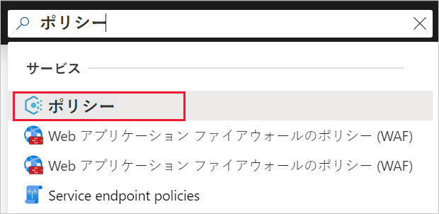
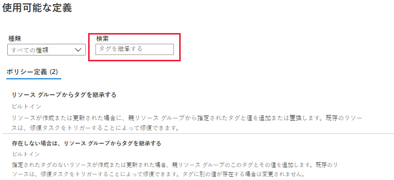

# ミニラボ: コンプライアンスを実施するためのポリシーを作成および管理する

このミニラボでは、Azure Policy を使用して、組織全体のポリシーの作成、割り当て、および管理に関連する次のようなより一般的なタスクをいくつか実行します。

* 今後作成するリソースに対して条件を強制するポリシーを割り当てる

* 複数のリソースについてコンプライアンスを追跡するイニシアティブ定義を作成して割り当てる

* 準拠していないリソースまたは拒否されたリソースを解決する

* 組織全体で新しいポリシーを実施する

## ポリシーを割り当てる

Azure ポリシーへの準拠を強制する最初のステップは、ポリシー定義を割り当てることです。ポリシー定義は、ポリシーが適用される条件と実行する効果を定義します。この例では、「*リソース グループからタグが欠落している場合は継承する*」という組み込みのポリシー定義を割り当て、指定されたタグとその値を親リソース グループから、タグのない新しいタグまたは更新されたリソースに追加します。

1. Azure portal に移動してポリシーを割り当てます。 「**ポリシー**」 を検索して選択します。

2. Azure Policy ページの左側にある 「**割り当て**」 を選択します。割り当ては、特定のスコープ内で行われるポリシーです。

![[ポリシーの概要] ページから割り当てを選択します](../../Linked_Image_Files/Demonstration_Policy_image2.png)

3. 「**ポリシー - 割り当て」** ページの上部から 「**ポリシーの割り当て**」 を選択します。

![[割り当て] ページからポリシー定義を割り当てます](../../Linked_Image_Files/Demonstration_Policy_image3.png)

4. 「**ポリシーの割り当て**」 ページと 「**基本**」 タブで、省略記号を選択し、管理グループまたはサブスクリプションを選択して、 「**範囲**」 を選択します。必要に応じて、リソース グループを選択します。スコープは、ポリシーの割り当てが適用されるリソースまたはリソースのグループを決定します。次に、 「**スコープ**」 ページの下部にある 「**選択**」 を選択します。

5. スコープに基づいてリソースを除外できます。除外は、 **スコープ**のレベルよりも 1 つ低いレベルから開始します。 **除外**はオプションであるため、ここでは空白のままにします。

6. **ポリシー定義**の省略記号を選択して、使用可能な定義のリストを開きます。ポリシー定義 「**タイプ**」 を 「*組み込み*」 にフィルタリングしてすべてを表示し、その説明を読むことができます。

7. 「**不足している場合はリソース グループからタグを継承する**」 を選択します。ポリシー定義を見つけて選択したら、 「**利用可能な定義**」 ページの下部にある 「**選択**」 を選択します。

8. 「**割り当て名**」 には、選択したポリシー名が自動的に入力されますが、変更できます。この例では、 「*リソース グループからタグを継承しない場合はそのまま*」にしておきます。オプションの**説明**を追加することもできます。説明には、このポリシーの割り当てに関する詳細が記載されています。

9. 「**ポリシーの適用**」 を 「*有効*」 のままにします。この設定を 「*無効*」 にすると、効果をトリガーせずにポリシーの結果をテストできます。 

10. 「**割り当て担当者**」 は、ログインしているユーザーに基づいて自動的に入力されます。 

11. ウィザードの上部にある 「**パラメーター**」 タブを選択します。

12. 「**タグ名**」 に「*環境*」と入力します。

13. ウィザードの上部にある 「**修復**」 タブを選択します。

14. 「**修復タスクの作成**」 をオフのままにします。このボックスでは、新規リソースまたは更新されたリソースに加えて、既存のリソースを変更するタスクを作成できます。 

15. このポリシー定義は変更効果を使用するため、 「**マネージド ID の作成**」 は自動的にチェックされます。 「**アクセス許可**」 は、ポリシー定義に基づいて自動的に 「*共同作成者*」 に設定されます。 

16. ウィザードの上部にある 「**Review + create**」 タブを選択します。

17. 選択内容を確認し、ページの下部にある 「**作成**」 を選択します。
