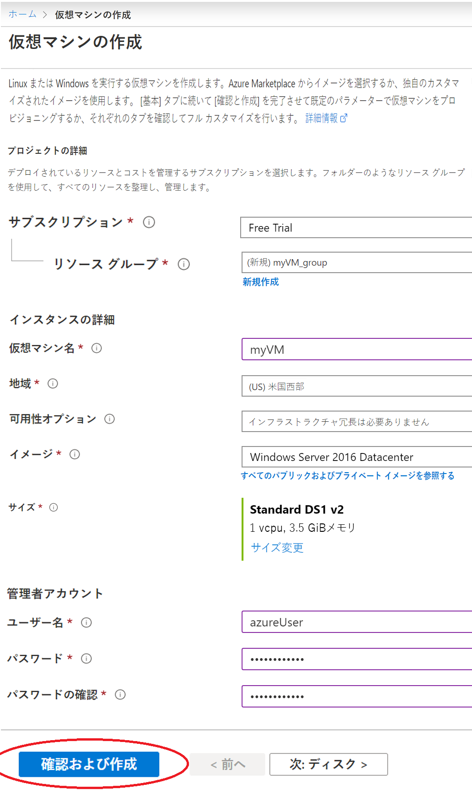
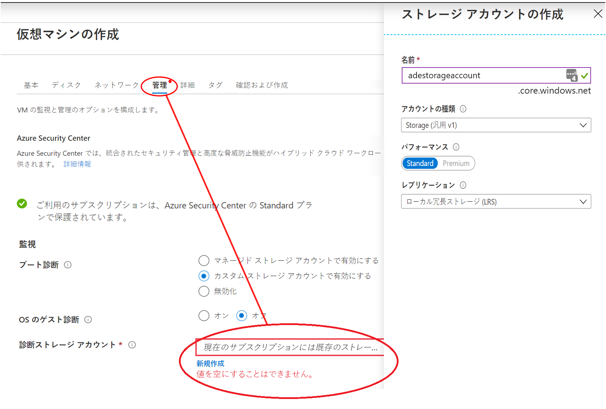
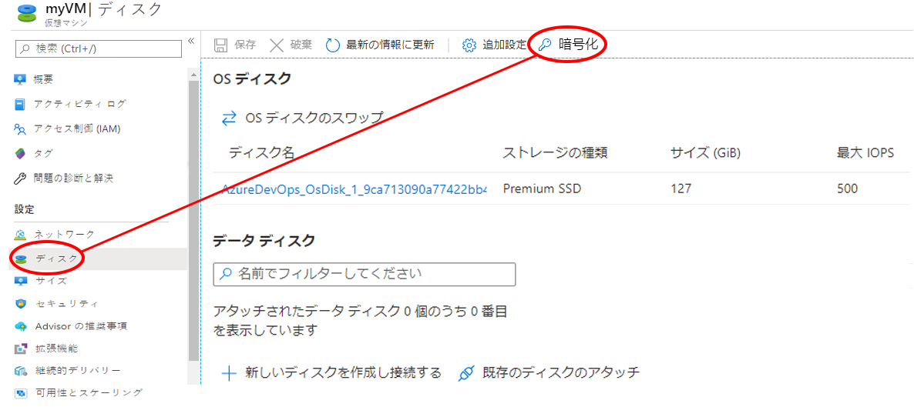
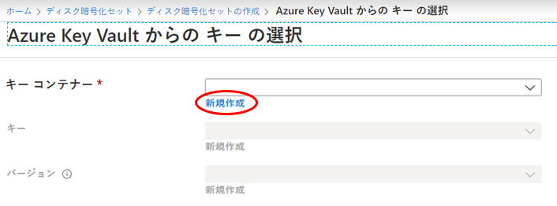
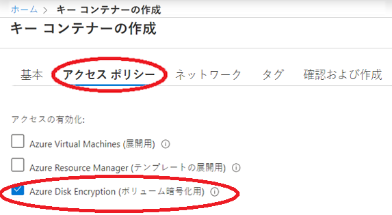

# ミニラボ: Azure portal を使用した Windows 仮想マシンの作成と暗号化

Azure 仮想マシン (VM) は、Azure portal を使用して作成できます。Azure portal は、VM とその関連リソースを作成するためのブラウザベースのユーザー インターフェイスです。このミニラボでは、Azure portal を使用して Ubuntu 18.04 LTS を実行する Windows 仮想マシン (VM) をデプロイし、暗号化キーの格納用のキー コンテナーを作成し、VM を暗号化します。

Azure サブスクリプションをお持ちでない場合は、開始する前に [無料アカウント](https://azure.microsoft.com/free/?WT.mc_id=A261C142F) 作成してください。

## 仮想マシンを作成する

1. Azure portal [https://portal.azure.com](https://portal.azure.com/) にサインインします。
1. Azure portal の左上隅にある **リソースの作成**を選択します。
1. 「新規作成」 ページの 「よく使用する」 で 、**「Windows Server 2016 データセンター」** を選択します。
1. **「基本」** タブの **「プロジェクトの詳細」** に、正しいサブスクリプションが選択されていることを確認し、**「新しいリソース グループの作成」** を選択します。名前として *myResourceGroup* と入力します。
1. **「仮想マシン名」** に *「MyVM」* と入力します。
1. **「リージョン」** で、地域 (*米国東部* など) を選択します。
1. **サイズ**が*標準 D2s v3* であることを確認します。
1. 「**管理者アカウント**」 で、「**パスワード**」 を選択します。ユーザー名とパスワードを入力します。

    
    
    >:警告: **警告**「**ディスク**」 タブには、「**ディスク オプション**」 の下に 「**暗号化の種類**」 フィールドがあります。このフィールドは、Azure Disk Encryption ではなく、Managed Disks + CMK の暗号化オプションを指定するために使用されます。混乱を避けるため、このチュートリアルを完了する間は **「ディスク」** タブを完全にスキップすることをお勧めします。

1. **「管理」** タブを選択し、診断ストレージ アカウントがあることを確認します。ストレージ アカウントがない場合は、**「新規作成」** を選択し、新しいアカウントに名前を付け、**「OK」** を選択します。

    

1. 「**Review + create**」 を選択します。
1. 「**仮想マシンを作成する**」 ページで、作成しようとしている VM の詳細を確認できます。準備ができたら、**作成** を選択します。

VM がデプロイされるまで数分かかります。デプロイが完了したら、次のセクションに進みます。

## 仮想マシンを暗号化する

>:警告: **警告**暗号化の秘密がリージョンの境界を越えないようにするため、Azure Disk Encryption では、キー コンテナーと VM が同じリージョンに共存している必要があります。暗号化する VM と同じリージョンにある キー コンテナーを作成して使用します。

1. VM デプロイが完了したら、**「リソースに移動」** を選択します。
1. 左側のサイド バーで、**「ディスク」** を選択します。
1. 「ディスク」 画面で、**「暗号化」** を選択します。 

    

1. 暗号化画面で、**「暗号化するディスク」** の下にある、**「OS ディスクとデータ ディスク」** を選択します。
1. **「暗号化の設定」** で、**「暗号化用のキー コンテナーとキーの選択」** を選択します。
1. **「Azure Key Vault からキーを選択」** 画面で、**「新規作成」** を選択します。

    

1. **「キー コンテナーの作成」** 画面で、リソース グループが VM の作成に使用したリソース グループと同じであることを確認します。
1. キー コンテナーに名前を付けます。Azure 全体のすべてのキー コンテナーには、一意の名前が必要です。
1. **「アクセス ポリシー」** タブで、ボリューム暗号化に **「Azure Disk Encryption」** を選択します。

    

1. 「**確認および作成**」 を選択します。  
1. キー コンテナーが検証に合格したら、**「作成」** を選択します。これにより、**Azure Key Vault からキーを選択** 画面に戻ります。
1. **「キー」** フィールドを空白のままにし、**「選択」** を選択します。
1. 暗号画面の上部にある、**「保存」** をクリックします。ポップアップが表示され、VM が再起動することを警告します。**「はい」** を選択します。

## リソースをクリーン アップする

不要になった場合は、リソース グループ、仮想マシン、およびすべての関連リソースを削除できます。これを行うには、仮想マシンのリソース グループを選択し、**削除** を選択 し、削除するリソース グループの名前を確認します。
